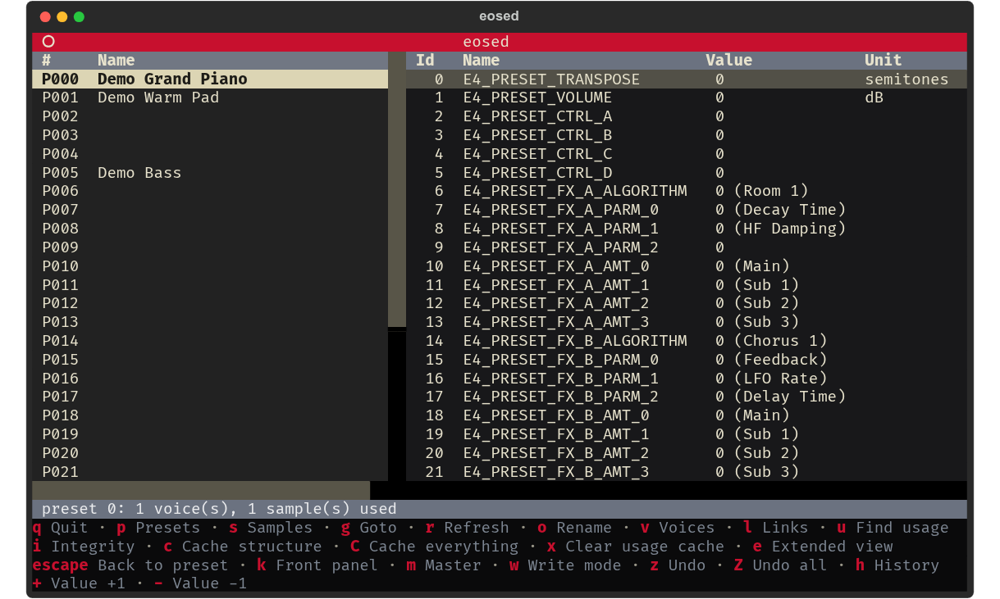
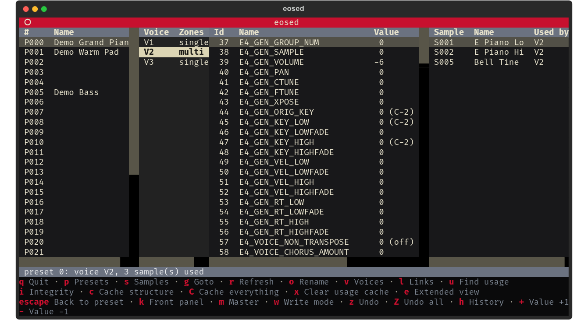
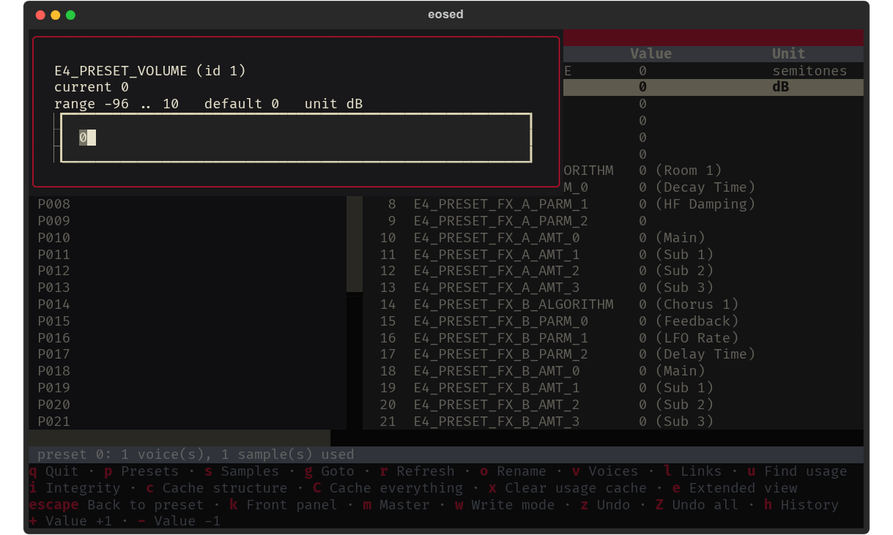
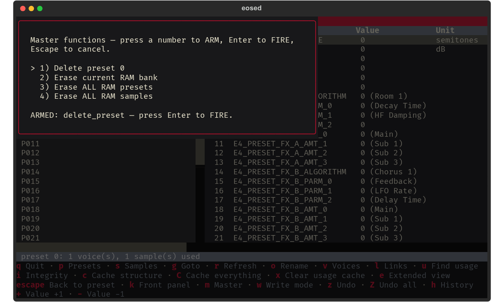
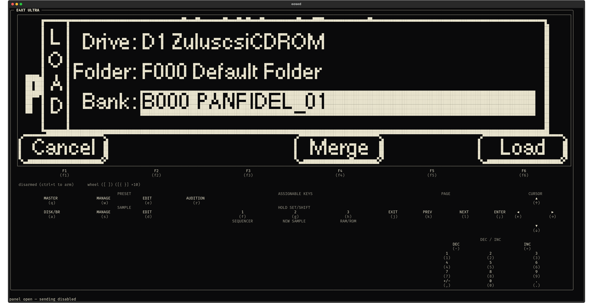
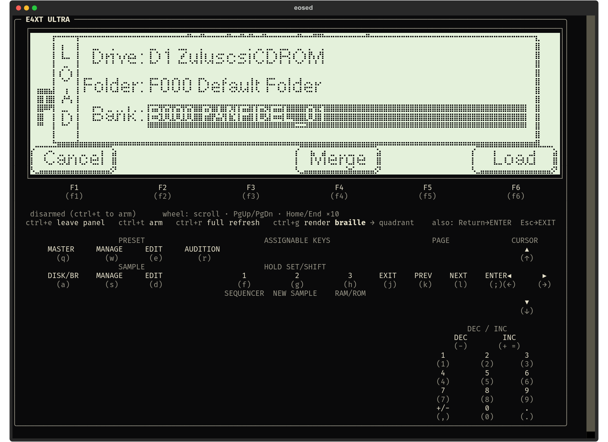
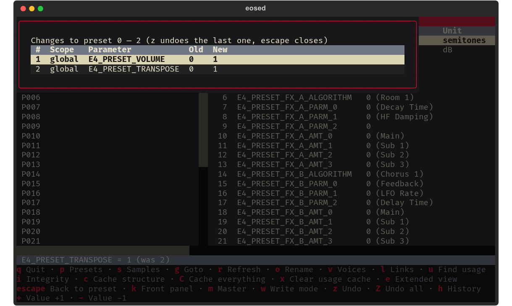

<!--
SPDX-License-Identifier: GPL-2.0-or-later
SPDX-FileCopyrightText: Copyright (C) 2026  eosed contributors
-->

# eosed

[](https://github.com/lentferj/eosed/actions/workflows/tests.yml)

A terminal tool for the E-mu **EOS** sampler family (E4, E4XT, E4XT Ultra,
E6400, …) driven over MIDI System Exclusive — a command-line explorer
(`eoscli`) plus a full Textual TUI **editor** (`eosed`) for the
documented remote editor/librarian protocol, from the same author as the
sibling **[k2kremote](https://github.com/lentferj/k2kremote)** (Kurzweil
K2000/K2000R), **[s3ked](https://github.com/lentferj/s3ked)** (Akai
S1000/S3000 family), **[mpc2emu](https://github.com/lentferj/mpc2emu)**
(sample-format conversion) and
**[VinSamLib](https://github.com/lentferj/VinSamLib)** (librarian and bank
builder for E4B, EIII/ESI and KRZ content) projects.

It also mirrors and drives the machine's **front panel** (`k`) over a second
protocol reverse engineered here from the machine's own traffic — including
the 240×64 LCD, live in the terminal. See [Front panel](#front-panel-k--a-second-protocol-an-exclusive-mode).

> **Author:** Jan Lentfer, with AI support
> (Anthropic Claude) — see [AI assistance](#ai-assistance--human-authorship).
> **Legal:** [DISCLAIMER.md](DISCLAIMER.md) · [LICENSE](LICENSE)

---

## Support this project

eosed is free software and always will be. Nothing is behind a paywall, no
feature is withheld, and none of what follows changes that.

But if it has been useful — if it let you browse a disk and load a bank from
where you are sitting instead of walking to the rack, put the E4XT's 240×64
LCD on your screen instead of leaning over it, or told you what a parameter
actually does without hunting through the front panel — then you might
consider supporting the work. **Best of all, if it means the sampler is
switched on and in use more often than it was**: that is what these projects
are for.

**Because here is what it has actually cost:**

- **A real E4XT Ultra on the bench.** Half of what this tool knows had to be
  measured rather than read. The editor protocol was transcribed from E-mu's
  own SysEx specification, but the **front-panel protocol had to be worked out
  from the machine's own traffic** —
  the frame layout, the key map, the data dial and the 240×64 display encoding
  were all reverse engineered from captures taken on this machine. The tool
  exists because the sampler was already here and in use, not the other way
  round.
- **Hours that are hard to count**, because protocol work is slow: measure, be
  wrong, measure again. Several single lines in this README are an evening at
  the bench, and the wrong turns are written down in
  [`docs/RESOLUTION_NOTES.md`](docs/RESOLUTION_NOTES.md) alongside the findings.
- **A MIDI interface, a SCSI emulator and media**, plus **AI assistance, which
  is a paid service** used heavily throughout and not cheap at this volume.

**This is support, not a donation — and the distinction is legal, not a turn of
phrase.** The author is based in Germany, where payments like these are not
`Spenden` in the tax sense: they are **taxable income** for the recipient and
are **not tax-deductible** for the giver, and **no donation receipt can be
issued**. A German reader who assumed deductibility would be the one actually
harmed by vaguer wording, so it is said plainly rather than dressed up. (That
is how it is handled here, not tax advice.)

If eosed has saved you the work, or made working with your vintage hardware
more fun, you can support it through
**[GitHub Sponsors](https://github.com/sponsors/lentferj)** — or the *Sponsor*
button at the top of the repository. Payment is handled entirely by GitHub and
Stripe, so bank and tax details are never handed to the person paying.

**Support is not expected, and it is not the only currency.**

- **Bug reports**, especially with the screen or the SysEx that produced them.
- **Confirmations from hardware that is not on this bench.** Everything here
  was verified on **one E4XT Ultra running firmware 4.70**. Whether an E4, an
  E6400, an e64 or an older EOS release behaves the same is genuinely unknown —
  many notes in `docs/RESOLUTION_NOTES.md` say "on this unit" for exactly that
  reason. A "works here too", or a "no, mine does X", is worth a great deal.
- **Corrections to the RE notes.** Wrong turns are recorded next to the
  findings; if one is wrong in a way that is still costing someone time, saying
  so improves the record.

---

## Where this came from, and what it is not

eosed is a **side product of [mpc2emu](https://github.com/lentferj/mpc2emu)**,
not a project that set out to be a sampler editor. mpc2emu converts sample
libraries for vintage hardware, and getting the *musical* parameters right —
filters, envelopes, LFOs, loops — means checking them against a real machine.
In practice that meant standing at an E4XT's front panel, pressing buttons,
saving banks to disk, and diffing them by hand.

eosed started as automation for that loop: if the sampler can be driven over
MIDI, a reverse-engineering probe can be **scripted, repeated and diffed**
instead of hand-performed. It still does that job — mpc2emu has driven this
protocol unattended for an amp-envelope calibration sweep
(`docs/RESOLUTION_NOTES.md` §15), and a good deal of what is documented here
was found by pointing it at hardware and watching what came back rather than
by reading the specification.

It grew a TUI because a probe you can steer interactively finds things a
fixed script does not. But it is **not trying to be beautiful — it is trying
to be useful**, which is where the name comes from. UNIX `ed`, the standard
editor, is not a pleasant program and never pretended otherwise: it is small,
it does exactly what you tell it, it assumes you know what you want, and it is
still on every Unix system decades after friendlier tools came and went.
`eosed` takes the same bargain. Expect dense panes, terse keys, and numbers
where a prettier tool would draw a knob.

### It is an editor, not a librarian

Worth saying plainly, because the protocol it speaks is conventionally called
an *editor/librarian* protocol and that phrase appears throughout these docs.
E-mu's specification earns both halves — it defines preset dump **and**
restore. **eosed implements the editor half.**

In the classical sense (Galaxy, SoundDiver, MIDI Quest), a librarian stores,
organises and — the defining part — **transmits patches back** to the device.
eosed does not. `eoscli dump` reads a preset off the machine into a file, and
there is nothing that sends one the other way: no restore, in either dump
format, at any layer. So what exists is a live parameter editor and browser,
plus **one-way backup**. A file eosed wrote is a record, not something it can
put back.

Where these docs say "editor/librarian protocol" they are naming **E-mu's
protocol**, not claiming its full scope — the protocol's own capabilities are
tabulated under [Two protocols, one
device](#two-protocols-one-device), with what is actually implemented marked
there.

---

## ⚠️ Use at your own risk — back up first, hardware verification is partial

eosed is provided **as is, with absolutely no warranty and no
liability** for data loss or **hardware damage**. You assume all risk.
Full terms: [DISCLAIMER.md](DISCLAIMER.md).

**eosed's *read* paths have been verified through repeated live
sessions against a real E4XT Ultra** — `eoscli inquire`/`config`/
`memory`/`catalog`/`dump`, and the full TUI's preset/voice/link/sample
browsing, bank switching, reverse sample-usage lookup, and cache-all
sweep. Live use is also what caught several real protocol bugs no amount
of reading the specification would have surfaced — see
[The "Number Of X" trap](#the-number-of-x-trap) below.

**Write paths are now verified, destructive ones included.**
Parameter edits and renames have been exercised against a real E4XT Ultra
across ten scratch presets: every preset-scoped parameter written, read
back, then re-read after selecting away and returning — 3340 comparisons
and 20 renames, all exact (`docs/RESOLUTION_NOTES.md` §18). That is also
what caught two real signedness bugs in the *read* path. **All four destructive Master actions have now been fired
against real hardware** and behaved as documented — Preset Delete, Erase RAM
Bank, Erase All RAM Presets, Erase All RAM Samples, each driven by hand from
the arm-then-fire modal with the state verified over SysEx before and after
(`docs/RESOLUTION_NOTES.md` §21a-§21d). Writing `E4_GEN_SAMPLE` and the
device-global `master.*` parameters remain unverified, and writes still
default to **disabled** (`--allow-write`, or `w` at runtime) against real
hardware. Those four Master actions are **one-shot destroyers** with no
device-side "are you sure", and being confirmed to work is precisely what
makes them dangerous rather than reassuring — Erase RAM Bank took a real
bank apart exactly as documented. None are ever bound to a single keypress
in the TUI, only reachable through a modal arm-then-fire screen, but a
scripting mistake with `eoscli` directly could still fire one. **Make
current backups before pointing this at anything you care about.**

**A panel sub-command exists that diverts the front panel to the remote.**
While it is in effect the machine stops responding to its own buttons
entirely, with nothing on screen to say why, until the counterpart message
hands control back. eosed never sends it, and it is not reachable from the
TUI or `eoscli` at all. It is called out here because the people most likely
to trip it are not eosed's users but anyone writing their own client for this
protocol: sweeping a sub-command range on a machine someone is standing at
will find it eventually, and the failure looks like dead hardware rather than
a message you sent. The specific bytes are withheld pending publication by
the third party who documented them.

---

## AI assistance & human authorship

eosed was built by its human author, **Jan Lentfer**, together with
Anthropic's **Claude**, following the pattern of the sibling k2kremote and
mpc2emu projects. The decision to build the documented editor protocol
first — rather than start from screen-mirroring, which would require
reverse engineering before a line of protocol code could be written —
came from the human author, as did every safety rule (destructive ops
are never key-bound; synthetic-first testing; one MIDI session at a
time) and every design correction that came out of actually using the
tool against real hardware. Claude assisted with transcribing the
parameter tables from the specification and writing the implementation,
tests, and docs. Full account, including the live-hardware bug hunts
that shaped this project, in [DISCLAIMER.md](DISCLAIMER.md).

---

## Quick Start

Needs **Python 3.11 or 3.12** (see [Python version](#python-version-pick-311-or-312)
below — 3.13+ works but wants a compiler) and nothing else to try out: no MIDI
interface, no sampler, no sound hardware of any kind.

**Linux / macOS:**

```sh
git clone https://github.com/lentferj/eosed
cd eosed
python3 -m venv .venv
.venv/bin/pip install -e .
.venv/bin/eoscli --demo inquire
.venv/bin/eosed --demo
```

**Windows** (PowerShell) — a venv puts its executables in `Scripts\`, not
`bin/`, so the paths differ throughout:

```powershell
git clone https://github.com/lentferj/eosed
cd eosed
py -3 -m venv .venv
.venv\Scripts\pip install -e .
.venv\Scripts\eoscli --demo inquire
.venv\Scripts\eosed --demo
```

To run the test suite as well, install the dev extra instead — `pip install -e
".[dev]"`. **Use double quotes.** Bare `.[dev]` is a glob in zsh (the default
shell on macOS), which fails with `no matches found`; single quotes are literal
characters in `cmd.exe`, which then looks for a package called `'.[dev]'`.
Double quotes are the one form that works in bash, zsh, PowerShell and
`cmd.exe` alike.

### Python version: pick 3.11 or 3.12

`python-rtmidi` 1.5.8 publishes wheels for CPython 3.8–3.12 only. On **3.13 and
newer there is no wheel for any platform**, so pip builds it from source and
you need a working C toolchain plus the MIDI development headers:

| | 3.11 / 3.12 | 3.13+ (source build) |
|---|---|---|
| **Linux** | wheel, nothing else needed | `sudo apt install build-essential libasound2-dev` |
| **macOS** | wheel, nothing else needed | `xcode-select --install` |
| **Windows** | wheel, nothing else needed | [MSVC Build Tools](https://visualstudio.microsoft.com/visual-cpp-build-tools/), "Desktop development with C++" |

Everything here works on 3.13 — CI builds and tests it on Linux and macOS —
it is just a much longer and more fragile install for no benefit. On 3.11 or
3.12 all three platforms install from a wheel in a few seconds.

`--demo` on both entry points runs against a canned in-memory device —
no MIDI port opened, no hardware required, no local config touched. This
is the safest way to explore the tool before pointing it at real
hardware; every screenshot in this README was captured this way.

<p align="center">
  
</p>

<p align="center"><sub>The default 2-pane compact view: Preset (left) and
Parameters (right) — preset 0 selected, its GLOBAL parameter group shown.</sub></p>

Real hardware use requires a MIDI interface connected to the E4/E4XT:

```sh
.venv/bin/eoscli ports                   # what this host can see at all
.venv/bin/eoscli inquire                 # autodetect, read-only identify
.venv/bin/eosed                      # TUI, writes disabled by default
.venv/bin/eosed --allow-write        # enables edit/rename/Master — see the warning above
```

(On Windows, `.venv\Scripts\eoscli`, `.venv\Scripts\eosed`.)

### Platform notes

Installation, demo mode and the full test suite are verified by CI on
**Linux, macOS and Windows**. Everything beyond that — talking to an actual
E4XT — has only ever been done from Linux by the author, so the notes below
are what the platform's MIDI stack does, not what this tool has been observed
doing on it. `eoscli ports` is the cheap first check on any of them.

- **macOS** — CoreMIDI is part of the OS; a class-compliant USB MIDI interface
  needs no driver and shows up in `eoscli ports` directly. Nothing extra to
  install. (The IAC Driver in *Audio MIDI Setup* only matters if you want
  virtual ports between applications; it is not needed to reach hardware.)
- **Windows** — WinMM likewise needs no driver for a class-compliant
  interface, but it grants a MIDI port to **one application at a time**: if
  your DAW is open and holding the interface, `eosed` cannot open it, and vice
  versa. That is stricter than Linux, where ALSA does *not* enforce exclusive
  access (see [DISCLAIMER.md](DISCLAIMER.md)) — so on Windows the OS happens to
  enforce this project's one-session-at-a-time rule for you.
  Run it in **Windows Terminal**; Textual renders poorly in the legacy
  `cmd.exe` console host.
- **Linux** — needs an ALSA sequencer (`/dev/snd/seq`). Containers, headless
  servers and some WSL setups have no MIDI subsystem at all, and `eoscli ports`
  says so explicitly rather than reporting an empty list.

If you route through `mididings` or similar, make sure the route does
**not** strip SysEx (see `docs/RESOLUTION_NOTES.md` §5 for a gotcha the
author hit on their own setup) — though note that `eoscli`/`eosed`'s
autodetect finds the real hardware send/receive ports directly and does
not go through such a route at all (confirmed live).

Autodetect (the default when `--port` is omitted) tries every MIDI port,
which can take tens of seconds on a host with many ports. Once it
succeeds, the winning send/receive port pair is cached to `config.toml`
(gitignored) and tried first on the next connection, before falling back
to a full sweep if the cache is stale (ports renamed/gone) — pass
`--config PATH` to use a different cache file, or edit
`eos/bridge.py`'s `DEFAULT_CONFIG_PATH`/pass `config_path=None` to a
script using `EosBridge.autodetect()` directly to disable caching.

---

## `config.toml` — all settings

A flat TOML file, **`config.toml` in the current working directory** by
default (`--config PATH` to point elsewhere). It is **gitignored**, optional —
every setting has a working default — and **never read or written under
`--demo`**, so exploring in demo mode cannot disturb your real setup.

Two of the keys are written *by* the app; the rest are yours to edit and the
app only reads them.

If you hand-edit it, **save it as UTF-8** — TOML is UTF-8 by specification and
that is what the parser accepts. Only the app's own header comment has ever
contained a non-ASCII character, so this rarely matters in practice; a file
eosed cannot parse is treated as absent, which means your settings fall back
to their defaults rather than raising an error.

| key | type | default | what it does |
|---|---|---|---|
| `send_port` | string | *(unset)* | **App-written, but you may set it.** Last MIDI output port that answered a Device Inquiry, tried first on the next launch so a reconnect skips the full port sweep — see [Two machines on one host](#two-machines-on-one-host). |
| `recv_port` | string | *(unset)* | **App-written, but you may set it.** The matching input port. |
| `compact_view` | bool | `true` | **App-written** by the `e` key. `true` = 2-pane (Preset \| Parameters), `false` = 4-pane (adds Voice and Samples). |
| `cache_structure_on_startup` | bool | `false` | Sweep the bank at `"structure"` depth on connect, so preset selection, bank paging and `u` are instant afterwards. ~23 min on a large bank, so it is opt-in — worth turning on for a session you know will involve a lot of browsing. |
| `cache_all_on_startup` | bool | `false` | Sweep at `cache_depth` on connect instead. Off by default because at `"full"` that is **1 h 44 min** on a large bank. |
| `cache_depth` | `"names"` \| `"structure"` \| `"full"` | `"full"` | Depth for the `cache_all_on_startup` sweep **only** — the `c`/`C` keys use fixed depths and ignore this. |
| `sample_usage_early_stop` | int \| `"fullscan"` | `10` | Stop a bank sweep after this many consecutive empty presets. `"fullscan"` disables early stopping and always sweeps the whole range. |
| `send_pc_on_preset_select` | bool | `true` | Send a real MIDI Program Change when a preset is selected, which is what actually makes the device switch preset and redraw its own LCD (the editor protocol's `PRESET_SELECT` does not — see [Two protocols, one device](#two-protocols-one-device)). |

Example:

```toml
# eosed local config — gitignored, safe to delete.
compact_view = false
cache_structure_on_startup = false   # start instantly, sweep on demand with 'c'
sample_usage_early_stop = "fullscan" # never stop early; banks with big gaps
send_pc_on_preset_select = true
```

Deleting the file simply restores every default; the port cache is rebuilt on
the next successful autodetect.

### Two machines on one host

Autodetect sends a **broadcast** Device Inquiry and every EOS unit answers, so
it can tell them apart by the SysEx device id each one is set to — which is
exactly what that setting is for. The EOS 4.0 Software Manual (p. 104, *MIDI
Device ID*) puts it plainly:

> This function allows an external SysEx programming device to distinguish
> between multiple Emulator units. In this case, each Emulator should have a
> different ID number.

With distinct ids, pick one with `--device-id N`. If several answer and you
did not say which you wanted, eosed **refuses and lists them** rather than
binding to whichever replied first — that choice would otherwise fall out of
MIDI port enumeration order and could change between reboots, which is a poor
way to decide where a Master erase lands.

Two units left on the *same* id cannot be told apart: their replies are
byte-identical, and so is one unit heard on two input ports. eosed cannot
detect that, and commands will reach both. Give them different ids.

> **Only tested synthetically.** All of the above — the ambiguity refusal,
> `--device-id` selection, and treating one unit heard on two input ports as
> one device — is covered by tests against fake MIDI ports. **It has never
> been run with two real machines connected**, because the author has one.
> Single-device autodetect *is* exercised live constantly. If you have two
> and it misbehaves, that is a bug worth reporting rather than something
> already ruled out.

You can also skip discovery entirely by pinning the ports, which is the only
option if your interface uses different names for send and receive (`--port`
opens one name for both, so it cannot express that):

```toml
# machine-a.toml
send_port = "MyInterface MIDI 4"
recv_port = "MyInterface MIDI 3"
```

then `eosed --config machine-a.toml`.

---

## eoscli — the command-line explorer

```
eoscli [--port NAME | --demo] [--device-id N] [--timeout SEC] [--config FILE] <command>
```

| Command | What it does |
|---|---|
| `ports` | list available MIDI ports |
| `inquire` | standard MIDI Device Inquiry; identifies model (E4/E4XT/E4XT Ultra/E6400/…) and EOS firmware revision |
| `config` | installed options (voice count, FX/MIDI/Octopus/Digital-I-O cards), RAM/ROM/Flash sizes |
| `memory` | Preset and Sample RAM totals/free space |
| `catalog [--range LOW-HIGH] [--progress]` | preset names over a range (default 0-127) |
| `get <param-id-or-name>` | read one parameter's current value, with its device-reported min/max/default |
| `dump <preset> <output> [--new-format]` | full preset dump to a file, using the ACK/NAK/WAIT/EOF handshake above |

```sh
.venv/bin/eoscli --demo inquire
.venv/bin/eoscli inquire                            # real hardware, autodetect
.venv/bin/eoscli catalog --range 0-269 --progress
.venv/bin/eoscli get E4_PRESET_VOLUME
.venv/bin/eoscli dump 0 preset0.bin
```

---

## eosed — the TUI

`e` toggles between a compact 2-pane view (Preset | Parameters, the
default on a fresh install) and the full 4-pane layout below; the choice
is remembered across restarts (against real hardware — `--demo` never
touches local state).

### Keys

| | |
|---|---|
| **Navigate** | `p` Presets · `s` Samples · `g` Goto · `r` Refresh · `escape` Back to preset |
| **Inspect** | `v` Voices · `l` Links · `u` Find usage · `i` Integrity · `h` History |
| **Cache** | `c` Cache structure · `C` Cache everything · `x` Clear usage cache |
| **Edit** | `Enter` Edit value · `+` Value +1 · `-` Value -1 · `o` Rename · `z` Undo · `Z` Undo all · `w` Write mode |
| **Other** | `e` Extended view · `m` Master · `k` Front panel · `q` Quit |

`PageUp`/`PageDown` page the Preset/Sample bank; inside the Parameters
pane they scroll normally. Scrolling near the bottom of a bank loads more
entries automatically. Every key above is also shown in the hint bar at the
bottom of the screen, which is generated from the same binding table this
list is — so the two cannot disagree.

<p align="center">
  
</p>

<p align="center"><sub>Extended view: Preset · Voice · Parameters · Samples.
A three-voice preset with <b>V2</b> selected — a multisample voice, so the
Samples pane resolves its zones down to the individual samples they play,
while V1 and V3 are single-sample.</sub></p>

Four panes, left to right:

- **Preset** — a paged, on-demand catalog scan (page size adapts to how
  tall the pane is). `p`/`s` switch this pane between the Preset and the
  raw Sample bank (browse/rename either); `g` goto and `o` rename are
  bank-aware. Beyond the currently-loaded page, `PageDown`/`PageUp` jump a
  whole page forward/back (replacing what's shown, the same as `g` but
  without typing a number), and just scrolling down with the arrow keys —
  or a mouse wheel — toward the bottom of what's loaded fetches and
  appends the next 50 entries in the background automatically, so you
  never hit a hard wall at the end of a page.
- **Voice** — every voice of the selected preset, with a single/
  multisample hint. `v` (from either bank) also opens a modal voice
  picker.
- **Parameters** — the selected voice's parameters, the parameters of a
  selected Link (`l`), or the preset's GLOBAL parameters if neither is
  selected; `escape` goes back.
- **Samples** — a *derived* view, not the Sample bank above: which raw
  sample(s) the selection actually plays (the whole preset's if no voice
  is selected, just that voice's otherwise), resolved from the voice's
  Sample Zone fields down to a sample number + name. Orthogonal to which
  bank the Preset pane is browsing.

**Bank-wide operations** (these sweep the whole preset range, so they
are the slow ones — see the timings below):

- **`u`** — **reverse sample lookup**, "which presets use this sample".
  Selecting a raw sample shows only its number and name — this protocol
  has no generic parameter access to loop points, root key or sample rate.
  `u` then answers the reverse question, with results shown both in the
  status line and — since the Samples pane is hidden in compact view — the
  Parameters pane too, so the full match list is visible in either view.
  This is a full preset-range sweep — not automatic, shows live progress,
  cancellable with `escape` — so on the **first** run it can take several
  minutes on a fully-populated bank; every later lookup (any sample, not
  just the one you first searched for) is then instant, no MIDI at all,
  until something is actually written. By default it stops early after 10
  consecutive presets/samples with nothing in them (a heuristic, not a
  guarantee); set `sample_usage_early_stop = "fullscan"` in `config.toml`
  to always sweep completely, or to a specific number to change the
  threshold. `x` clears the cached result on demand to force a fresh
  sweep.
- **`i`** — **bank integrity check**: every preset whose voices still point
  at a sample that no longer exists, reported as `P012 V3 → S045 (missing)`.
  A voice keeps its sample number after that sample is erased, and nothing
  at the voice level distinguishes a live reference from a dead one — so
  the Samples pane and `u` both display an erased sample exactly as they
  would a present one. Useful beyond the erase case: a bank restored from
  disk with samples missing, or one assembled by an external writer (such
  as [mpc2emu](https://github.com/lentferj/mpc2emu), which writes E4B
  banks), shows the same symptom with no other way to spot it short of
  checking every voice by hand. Read-only, so it needs no write mode.
  It uses the *same* sweep as `u` and `c` and no MIDI beyond it, so it is
  instant once any of the three has run; run cold it costs one sweep.
  A voice with nothing assigned reads sample 0 and is never reported, and
  neither is a sample whose name lookup simply *failed* — that is
  "unknown", not "missing".
- **`c` / `C`** — cache the bank: the same full-bank sweep as `u`, but keeps
  *everything* it fetches instead of just the sample-usage index —
  preset and sample names, each preset's voice/zone/sample structure,
  and (depending on depth) its GLOBAL parameter values and every voice's
  own parameters too — so that browsing afterward (selecting a preset,
  `v`, paging the bank, `u`) is instant with no further MIDI at all,
  until something is actually written. The two keys are **fixed depths**,
  so each means a predictable amount of work: **`c`** sweeps
  `"structure"` (both name catalogs plus the voice/zone/sample walk and
  the `u` index) and **`C`** sweeps `"full"` (all of that, plus each
  preset's GLOBAL values and every voice's own parameter group — by far
  the priciest addition, and 4.5× slower).

  **Neither runs automatically** — eosed starts instantly and sweeps only
  when you ask. Set `cache_structure_on_startup = true` to run the `c`
  sweep on connect, or `cache_all_on_startup = true` to run the deeper
  `cache_depth` one (`"names"`/`"structure"`/`"full"`, default `"full"`).
  Both are off by default because on a large bank they cost 23 min and
  1 h 44 min respectively. `cache_depth` only affects that startup sweep —
  it does not change what `c`/`C` do.
  **Never persisted to disk** —
  rebuilt fresh every launch, deliberately: the E4XT can be edited from
  its own front panel with no way for this app to notice, so a saved
  cache could confidently show data that no longer matches the device.

  On a large bank this takes a **long** time, so `c`/`C` ask first (and
  tell you the estimate) whenever the sweep looks like it will run for
  more than a minute — see [How long cache-all takes, and when it is
  worth it](#how-long-cache-all-takes-and-when-it-is-worth-it).
- **Selecting a preset also sends it a MIDI Program Change** (no key
  binding — happens automatically), which is what actually makes the
  E4/E4XT select that preset for real and redraw its own front-panel
  LCD; the editor protocol's own `PRESET_SELECT` never does (see
  [Two protocols, one device](#two-protocols-one-device) above). Set
  `send_pc_on_preset_select = false` in `config.toml` to turn this off
  (default: on).

### How long cache-all takes, and when it is worth it

Measured against a **real E4XT Ultra (rev 4.70)** at the default 50 ms send
gap, on a full commercial bank — **990 populated presets, 128 MB of samples,
6198 voices** (drum kits of 80-94 voices each pull that average up to ~6.3
voices per preset):

| depth | key | full 0-999 sweep | per 50 presets | what you get |
|---|---|---|---|---|
| `"names"` | — *(startup only)* | 150 s (2.5 min) | ~8 s | preset + sample name catalogs |
| `"structure"` | **`c`** | 1371 s (23 min) | ~69 s | + voice/zone/sample structure, and the `u` index |
| `"full"` | **`C`** | **6241 s (1 h 44 min)** | ~310 s | + GLOBAL values and every voice's own parameters |

`"full"` is **4.5× `"structure"`** on this bank, because it adds a batched
146-parameter fetch per *voice* — 6198 of them — where `"structure"` only
walks each voice once.

**These numbers scale with *voices*, not presets.** A 990-preset bank of
one-voice pads is an order of magnitude cheaper than the same count of
94-voice drum kits, because `"structure"` and `"full"` walk every voice
individually. Treat the per-50-presets column as a rough middle case and
expect real banks to land either side of it. `"names"` is the exception — it
sweeps both name catalogs and barely cares what is inside the presets.

**Older hardware will be slower.** These are Ultra figures; non-Ultra E4
models have noticeably slower CPUs, and device response time — not our send
pacing — is already the dominant cost (cutting the send gap from 25 ms to
5 ms bought only ~30%, see `docs/RESOLUTION_NOTES.md` §19a).

**When it is worth it**

- **Yes, if you are going to browse a lot.** The payoff is that afterwards
  selecting presets, opening voices (`v`), paging the bank and running `u`
  cost *no MIDI at all*. If you plan to spend half an hour exploring a bank,
  paying 20 minutes up front to make all of it instant is a good trade.
- **You may not need it at all if you run `u`.** A `u` lookup *is* a
  `"structure"`-depth sweep that answers one question on the way, and it
  keeps everything it fetched — both name catalogs, every preset's
  voice/zone/sample structure, and the usage index for **every** sample it
  saw, not just the one you asked about. So after one `u`, preset selection,
  bank paging and `u` on any other sample are already instant, and running
  `c` afterwards would re-do work you have. (The reverse holds too: `c`
  makes a later `u` instant.) Only `C` adds anything `u` does not — every voice's own parameter group.
- **No, for a quick look.** Selecting a handful of presets fetches only what
  it needs; a sweep to look at three presets is pure overhead.
- **No, if you are about to write.** Any parameter edit, rename or Master
  action invalidates **every** cache uniformly (deliberately — see
  [Two protocols, one device](#two-protocols-one-device)), so a sweep
  followed by an edit throws the whole thing away.
- **Consider a shallower depth.** `"names"` costs ~2.5 minutes and already
  makes bank browsing and `g` instant, which is most of the everyday benefit.
  `"full"` mainly pays off if you will actually open many *voices*.

Because a `"full"` sweep of a big bank runs for the better part of an hour,
`c`/`C` **ask first** whenever the estimate exceeds a minute, showing what
they expect. The estimate comes from **used preset RAM** (one query, before the
sweep starts) rather than preset count — RAM tracks how many voices a bank
holds, which is what actually costs time, and preset count cannot tell a
bank of pads from a bank of drum kits. `escape` cancels a running sweep at
any point; a cancelled sweep caches nothing, since there is no way to tell
"not found" from "not reached".

Neither startup sweep prompts: both are explicit opt-ins in `config.toml`,
so asking again on every launch would just be nagging. Both announce their
estimate in the status line, and `escape` cancels either at any point.

Editing, renaming, and the Master menu:

<p align="center">
  
</p>

<p align="center"><sub>Editing a parameter: the dialog shows the
device-fetched current value, range, default, and unit before you type a
new one.</sub></p>

- Edits a parameter's value in place (device-fetched min/max/default
  shown), renames a preset or sample, and a modal arm-then-fire Master
  screen for the destructive utilities (Delete Preset, Erase RAM
  Bank/Presets/Samples — never bound to a single keypress).

- **Three ways to change a value.** `Enter` opens the dialog above and you
  type a number. Inside that dialog the arrow keys step the value (`↑`/`↓`
  by 1, `PageUp`/`PageDown` by 10) instead of retyping it. And straight
  from the Parameters pane, `+`/`-` nudge the highlighted parameter by one
  step with no dialog at all (`=` works as `+`, so it needs no shift key).
  Arrow keys are deliberately *not* bound in the pane itself — they move
  the row cursor, which is the one navigation the app can't give up.

  Nudges clamp to the device's own reported min/max, and a run of
  consecutive nudges to the same parameter collapses into a single undo
  entry keeping the value the run started from — holding `+` for ten steps
  is one edit as far as `z` and the history are concerned.

<p align="center">
  
</p>

<p align="center"><sub>The Master menu requires two keypresses (arm, then
Enter to fire) for any destructive operation — never a single
keystroke.</sub></p>

- **Writes (edit/rename/Master) are disabled by default against real
  hardware** — pass `--allow-write` to start already armed, or press `w`
  at any point during the session to arm/disarm them at runtime (always
  starts armed for `--demo`, but `w` still toggles it there too). The
  header bar turns the E4XT badge's own red while write mode is on, a
  persistent, glanceable reminder that's easy to miss in the status line
  alone. No write path has been exercised against real hardware as
  thoroughly as the read paths yet — see [TODO.md](TODO.md).

### Front panel (`k`) — a second protocol, an exclusive mode

`k` opens a control surface laid out like the E4XT's own front panel, **with
the machine's real LCD in it**, live.

<p align="center">
  
</p>

<p align="center"><sub><b>Half-block render.</b> A real captured screen — the
device's LOAD page. Layout follows the hardware: PRESET's MANAGE/EDIT above
SAMPLE's, assignables and the PAGE group on the lower row, keypad at the
right, soft keys under the display's own menu boxes.</sub></p>

**This is the *panel* protocol, not the editor protocol** the rest of eosed
speaks — `F0 18 7F <devID> 7A …`, reverse engineered here from the machine's
own traffic (`docs/RESOLUTION_NOTES.md` §26–§34). E-mu did document it, in the
1996 "Peptalk" remote-control document, which this project did not have at the
time; the opcodes derived here agree with it. A panel press drives the machine's
own UI; everything else in this app edits parameters directly and does *not*
move the front panel.

**The LCD is decoded, not mirrored from anyone's tool.** The screen arrives as
a plain bitstream, seven bits per byte, 240×64 — a decoding this project
derived from its own captures, since nothing about the EOS display has ever
been published. Three renders, switchable at runtime with `ctrl+g` or chosen
at launch with `--panel-render`:

| render | cells | needs | aspect | reads like |
|---|---|---|---|---|
| `half` | 1×2 px, 240×32 | 244 cols | **true** | crispest — pixels 1:1 horizontally, strokes stay separate |
| `quadrant` *(default)* | 2×2 px, 120×32 | 124 cols | 2× too tall | most detail per column, but the screen is visibly stretched |
| `braille` | 2×4 px, 120×16 | 124 cols | **true** | compact and correctly shaped; 1px strokes merge into dots |

Aspect is worth knowing before choosing. The real display is 240×64 — a wide
strip, 3.75:1. Terminal cells are about twice as tall as they are wide, so
`half` (240×32 cells) and `braille` (120×16) both come out at 3.75:1, while
`quadrant` (120×32) lands at 1.9:1 and stretches the screen vertically by two.
It stays the default because it packs the most detail into 124 columns, but if
you have the width, `half` is what the machine actually looks like.

<p align="center">
  
</p>

<p align="center"><sub><b>Braille render</b> — the same screen at 2×4 pixels
per cell. Half the height of quadrant for the same width and correctly
proportioned, at the cost of the device's one-pixel strokes merging into
neighbouring dots, so it reads more as texture than as type.</sub></p>

**Refresh is measured, not guessed** (§33b). A full screen costs 2212 bytes
and ~716 ms of MIDI; the delta request costs 86 bytes and ~70 ms. So the pane
polls the cheap one twice a second, uses whatever full frame comes back,
escalates only for partials it cannot decode, and gives you `ctrl+r` to force
a full read. The device never pushes — it answers, so a client must ask.

**Bindings are positional, not mnemonic.** The panel's two button rows run
left-to-right along the keyboard's two home rows, so `q w e r` is MASTER /
PRESET MANAGE / PRESET EDIT / AUDITION and `a s d f g h j k l ;` continues
beneath it. Where the two agree you get both for free: F1–F6 are the
keyboard's F1–F6 (and are drawn under the display's own soft-menu boxes), and
the cursor diamond is the arrow cluster. The keypad is the number row, `,` is
`+/−`, `-`/`=` are DEC/INC, and `[`/`]` turn the data wheel — `{`/`}` move ten
detents at once, which is what the device itself does when a human spins fast.

**It is an exclusive mode.** While the panel is up it swallows every key,
mapped or not, so it reuses keys the main view binds — `s` is SAMPLE MANAGE
here and the samples pane there. `escape` leaves.

**Sending is gated twice.** Opening the panel transmits nothing but the
session open. `ctrl+t` arms it, and arming requires write mode to be on
already. Until then keys only highlight — deliberate, because this protocol is
was reverse engineered rather than read from a specification, and the
machine's menus include the one-shot erase utilities.

### Undo (`z`), undo-all (`Z`), and the change history (`h`)

<p align="center">
  
</p>

<p align="center"><sub>The change history (<code>h</code>): every edit with
the scope it was made under. The three consecutive <code>+</code> nudges of
one parameter collapse into a single entry keeping the value the run started
from.</sub></p>

Every parameter edit and preset rename made in the session is logged with the
value it replaced *and* the selection it was made under (voice/link/global) —
the protocol is stateful, so an undo re-selects that scope before writing the
old value back, otherwise it would land on whatever is selected now.

- **`z`** steps back one change at a time, reporting each in the status line
  (`reverted E4_PRESET_VOLUME from 5 to 0`).
- **`Z`** returns the preset to how it was when loaded.
- **`h`** opens a `# | scope | parameter | old | new` table of everything so
  far. Scope is a column of its own, since the same parameter id edited under
  two different voices is two genuinely different fields.

An undo is a write like any other, so it is gated behind write mode — if
writes are disarmed, `z`/`Z` decline for the same reason an edit would. A
pending-change count shows in the header (`preset 12 · Δ3`) rather than the
status line, which any load or scan would otherwise scroll away.

The log is **in-memory and per-preset**: selecting a different preset
discards it, since every write goes to whatever `PRESET_SELECT` points at and
a log for an unselected preset could not be replayed safely. That is not a
limitation so much as a reflection of how the hardware works — a remote edit
only lives in the device's RAM until you save the bank to disk *on the
machine itself*, so reloading the bank or power-cycling is the real "undo
everything", and nothing here needs to survive a restart to be safe.

### Not yet implemented

**Preset restore — sending a dumped preset back to the device — in either
format.** The specification defines it and `eos/messages.py` can already
encode the frames, but nothing wires them to a send path: there is no bridge
method and no `eoscli` command. This is the one gap that decides what the
tool *is* (see [It is an editor, not a
librarian](#it-is-an-editor-not-a-librarian)), so it is listed first rather
than among the smaller omissions.

Also: editing a raw sample's own properties (loop points, root key, sample
rate — this protocol has no generic parameter access to those; see
`docs/RESOLUTION_NOTES.md` §10), Link browsing as a persistent pane
(currently a modal, same as Voice), and — on the panel protocol — decoding the
partial screen updates, and the disk browse/load sequence the panel work
exists to enable. See [TODO.md](TODO.md).

*NEW-format **dump** is implemented* (`eoscli dump --new-format`,
`EosBridge.dump_preset_new`) — an earlier version of this list said it was
not, while Known Limitations below said it was. Both were describing
"dump/restore" as one item when only half of it exists.

---

## The EOS Remote Protocol — a field manual

This section documents the protocol itself, independent of either tool
built on top of it — useful if you're implementing your own client, or
just want to understand what an E4/E4XT actually exposes over MIDI.
Everything below is transcribed as *data* from E-mu's own specification,
**"Remote Preset Editing via MIDI SysEx"** (Draft #30, EOS 4.00, Brian
Clark, E-mu Systems, 17 February 1999) — see [LICENSE](LICENSE) for the
full citation — cross-checked, where noted, against real E4XT Ultra
hardware and saved preset dumps.

### Two protocols, one device

EOS exposes **two separate SysEx dialects**, and this project's position
on each is very different — keep the distinction sharp:

1. **The remote editor/librarian protocol** — `F0 18 21 <devID> 55 <cmd>
   … F7`. Fully documented in the specification above: parameter
   edit/request with live min/max/default query, preset dump/restore,
   preset/sample naming, memory/config queries, and voice/link/sample-zone
   utilities. **This is the entire subject of this section, and what
   `eos/` and `eoscli`/`eosed` implement — with one exception: preset
   *restore* is specified and frame-encodable but has no send path here, so
   dumping is one-way.** That list describes E-mu's protocol, not this
   tool's coverage of it.
2. **The panel/remote-control protocol** — `F0 18 7F <devID>
   7A … F7`. The device's own LCD and front-panel keys (the same *kind* of
   thing k2kremote does for the K2000). E-mu documented it in 1996
   ("Peptalk"), but that document was not available to this project while the
   work was done, so it was reverse engineered from the machine's own traffic;
   a third party published the session handshake in 2016
   ([midimachines](https://midimachines.wordpress.com/2016/04/30/arduino-midi-and-sampler-ultra-series/)),
   and **eosed now implements it** — session open, the full key map, the data
   wheel, and the 240×64 display, all captured and decoded here. Note the
   frame header is `<devID> 7A`, not the `00 00` those published fragments
   record (§28). See `docs/RESOLUTION_NOTES.md` §26–§34 and
   [Front panel](#front-panel-k--a-second-protocol-an-exclusive-mode).

A subtlety worth internalizing before writing any client: **an edit made
through the editor protocol does not appear on the device's own front
panel until that preset is touched from the front panel.** The
specification states this explicitly — the remote editor writes to a
separate live buffer from what the LCD renders. Don't assume the two
agree; a TUI or script must track its own state, not read the hardware's
screen as ground truth. There is no command anywhere in the documented
protocol to force a redraw — confirmed by checking every command byte
`eos/messages.py` defines and the raw specification text itself, whose
own stated design goal is that the remote editor *replaces* the front
panel display as the interface, not drives it. The one thing that
*does* make the device select a preset for real (and redraw its own
LCD) is a plain MIDI **Program Change** — an ordinary channel voice
message, not part of this SysEx protocol at all, and exactly what a
keyboard player sends switching patches. `EosBridge.send_program_change`
implements it: Bank Select MSB is always 0, LSB selects which block of
128 presets (0 → 0-127, 1 → 128-255, …), then Program Change picks
within that block — all three messages required every time, each
separated by `SEND_GAP` (plain channel messages get no throttling of
their own the way SysEx does, and sending them back-to-back with zero
gap got them dropped or misprocessed by the MIDI interface in testing).
See `docs/RESOLUTION_NOTES.md` §14 for the live debugging story. There is
no way to read back which preset the device currently has selected this
way — `PRESET_SELECT` stays unaffected, confirmed live — so verifying it
landed correctly still means looking at the actual front panel.

### Addressing model

Every parameter lives in one of a small number of **groups**, and which
group a given `PARAMETER_EDIT`/`PARAMETER_REQUEST` addresses depends on
four **selector** parameters (themselves ordinary parameters, ids
223–227) that must be set first:

| Selector | id | Range | Selects |
|---|---|---|---|
| `PRESET_SELECT` | 223 | 0–999 | Which preset all GLOBAL/LINK/VOICE reads/writes below apply to. Independent of the front panel's own selection (spec-stated) — selecting a preset here does not change what's showing on the device's LCD. |
| `LINK_SELECT` | 224 | 0–255 | Which of the current preset's Links a `link.*`-group parameter addresses. Max is `255 − NumOfLinks`. |
| `VOICE_SELECT` | 225 | 0–255 | Which of the current preset's Voices a `voice.*`-group parameter addresses. Max is `255 − NumOfVoices`. |
| `SAMPLE_ZONE_SELECT` | 226 | 0–255 | Which zone of a *multisample* voice a Sample-Zone-scoped field (a subset of `voice.general`, see below) addresses. Reset to 0 whenever a new Voice is selected (spec-stated) — a stale zone selection left over from a previous voice is a real, easy-to-hit bug (see [The "Number Of X" trap](#the-number-of-x-trap)). |
| `GROUP_SELECT` | 227 | 0–31 | Selects a voice group for group-scoped operations. |

Once selected, a normal parameter read/write (`PARAMETER_EDIT` = `01h`,
`PARAMETER_REQUEST` = `02h`) addresses whichever group/instance the
selectors currently point at. `PARAMETER_MINMAXDEFAULT_REQUEST` (`03h`)
/ `_RESPONSE` (`04h`) return the **device's own live** min/max/default
for a given parameter id — this project's own static tables (below) are
a convenience fallback, but the live response is authoritative and
should be preferred wherever the two might drift across EOS firmware
revisions.

### Command set

The full command byte (immediately following the `55h` "special editor
designator" byte in every frame) implemented by this project's
`eos/messages.py`:

| Command | Byte | Direction | Purpose |
|---|---|---|---|
| `PARAMETER_EDIT` | `01h` | → device | Set a parameter's value |
| `PARAMETER_REQUEST` | `02h` | → device | Read a parameter's current value |
| `PARAMETER_MINMAXDEFAULT_REQUEST` | `03h` | → device | Ask for a parameter's live min/max/default |
| `PARAMETER_MINMAXDEFAULT_RESPONSE` | `04h` | ← device | Reply to the above |
| `PRESET_NAME` | `05h` | ↔ | Set/read the current preset's 16-char name |
| `PRESET_NAME_REQUEST` | `06h` | → device | Request the above |
| `PRESET_NAME_CHAR_UPDATE` | `07h` | → device | Update a single character of the name |
| `PRESET_NAME_CHAR_REQUEST` | `08h` | → device | Request a single character |
| `SAMPLE_NAME` | `09h` | ↔ | Set/read a sample's 16-char name |
| `SAMPLE_NAME_REQUEST` | `0Ah` | → device | Request the above |
| `SAMPLE_NAME_CHAR_UPDATE` | `0Bh` | → device | Update a single character |
| `SAMPLE_NAME_CHAR_REQUEST` | `0Ch` | → device | Request a single character |
| `PRESET_DUMP` | `0Dh` | ↔ | Full preset dump/restore, sub-commanded (ACK/NAK/WAIT/EOF handshake). **Dump implemented; restore not** — frames encode, nothing sends them |
| `PRESET_DUMP_REQUEST` | `0Eh` | → device | Request an OLD-format single-preset dump |
| `PRESET_MEMORY_REQUEST` / `_RESPONSE` | `10h`/`11h` | ↔ | Preset RAM total/free (KB) |
| `SAMPLE_MEMORY_REQUEST` / `_RESPONSE` | `12h`/`13h` | ↔ | Sample RAM total/free (10 KB units) |
| `CONFIGURATION_REQUEST` / `_RESPONSE` | `14h`/`15h` | ↔ | Installed option flags, RAM size |
| `PRESET_NUM_VOICES_REQUEST` / `_RESPONSE` | `16h`/`17h` | ↔ | Voice count for a preset — **see the trap below** |
| `PRESET_NUM_LINKS_REQUEST` / `_RESPONSE` | `18h`/`19h` | ↔ | Link count for a preset |
| `PRESET_NUM_SZONES_REQUEST` / `_RESPONSE` | `1Ah`/`1Bh` | ↔ | Sample-zone count for a preset |
| `VOICE_NUM_SZONES_REQUEST` / `_RESPONSE` | `1Ch`/`1Dh` | ↔ | Sample-zone count for one voice — **see the trap below** |
| `EXTENDED_CONFIGURATION_REQUEST` / `_RESPONSE` | `1Eh`/`1Fh` | ↔ | Extended option flags, ROM/Flash size |
| `NEW_VOICE` / `DELETE_VOICE` / `COPY_VOICE` | `20h`/`21h`/`22h` | → device | Voice-list editing |
| `NEW_SAMPLE_ZONE` / `GET_MULTISAMPLE` / `DELETE_SAMPLE_ZONE` / `COMBINE` / `EXPAND` | `30h`–`34h` | → device | Sample-zone editing |
| `NEW_LINK` / `DELETE_LINK` / `COPY_LINK` | `40h`/`41h`/`42h` | → device | Link-list editing |
| `SAMPLE_ERASE` / `SAMPLE_MEMORY_DEFRAG` | `50h`/`52h` | → device | Sample-memory housekeeping |
| `PRESET_COPY` | `70h` | → device | Copy a preset |
| `PRESET_DELETE` | `71h` | → device | **Destructive, one-shot, unconfirmed** |
| `MULTIMODE_MAP_DUMP` / `_REQUEST` | `72h`/`73h` | ↔ | MultiMode channel/preset map |
| `ERASE_RAM_BANK` | `74h` | → device | **Destructive, one-shot, unconfirmed** |
| `ERASE_ALL_RAM_PRESETS` | `75h` | → device | **Destructive, one-shot, unconfirmed** |
| `ERASE_ALL_RAM_SAMPLES` | `76h` | → device | **Destructive, one-shot, unconfirmed** |
| `NEW_DUMP_NAK` / `NEW_DUMP_ACK` / `EOF` / `WAIT` / `CANCEL` | `79h`–`7Dh` | ↔ | NEW-format dump handshake |
| `NAK` / `ACK` | `7Eh`/`7Fh` | ↔ | OLD-format dump handshake (1-byte packet numbers) |

Not every command above has a corresponding high-level method in
`eos.bridge.EosBridge` yet — voice/link/sample-zone list editing
(`NEW_VOICE`/`DELETE_VOICE`/…) and the destructive Master utilities
beyond what the TUI exposes are implemented at the message-codec level
in `eos/messages.py` but not yet wired into a convenience API. See
[TODO.md](TODO.md).

### The "Number Of X" trap

The specification names four sibling commands — `PRESET_NUM_VOICES`,
`PRESET_NUM_LINKS`, `PRESET_NUM_SZONES`, `VOICE_NUM_SZONES` — that read,
from their names and the surrounding text, like they return plain counts.
**Live testing against a real E4XT Ultra disproved this for three of the
four, each in its own way, and each only found by actually comparing the
TUI's numbers against the front panel** — not derivable from reading the
specification alone:

- **`VOICE_NUM_SZONES` is not a count at all**, in any consistent sense.
  Two different real presets gave zone counts that needed *different*
  additive corrections to match ground truth — no single formula
  reconciles them. The real, reliable signal turned out to be
  voice-level `E4_GEN_SAMPLE`: it reads the specification's own
  "multisample" sentinel (`−1`) if and only if the voice genuinely is one, and
  from there the only trustworthy way to find the real zone count is to
  walk `SAMPLE_ZONE_SELECT` from 0 until `E4_GEN_SAMPLE` reads back `0`
  — empirically the clean, consistent "past the real data" signal in
  every case tested.
- **`PRESET_NUM_VOICES` looked like a simple off-by-one** (subtract 1
  from the raw wire value) — confirmed against *two* saved dump files on
  two different presets — and shipped on that basis. It then failed live
  on presets from a different, larger real bank: two presets each
  front-panel-confirmed to have exactly one real voice both read a raw
  value that the "−1" correction turned into zero. **Two independent
  cross-checks were not enough evidence for a general formula.** The
  reliable signal turned out to be the same kind as above, one level up:
  a device-consistent (but undocumented) `−2` "this voice index does
  not exist" marker on voice-level `E4_GEN_SAMPLE`, distinct from the
  `−1` multisample sentinel above. (Both were first recorded as the raw
  words `3FFEh`/`3FFFh`; the parameter later turned out to be *signed*,
  which is all those bit patterns ever were.)
- **`PRESET_NUM_LINKS`, despite sharing a command family and byte shape
  with `PRESET_NUM_VOICES`, needed no correction at all** — its raw wire
  value is already the plain, direct count. This was found by
  extrapolating the sibling's "−1" fix onto this command without an
  independent test — exactly the mistake the two points above already
  demonstrate the cost of.
- **`PRESET_NUM_SZONES`** remains unverified — not called anywhere in
  this project, deliberately, rather than guessing a fourth formula with
  zero live evidence behind it.

The lesson, demonstrated the hard way more than once in the same
afternoon: **sharing a command family, byte range, or name is no
evidence at all about how a "Number Of X" command actually behaves.**
Every one needs its own independent live check, no matter how similar it
looks to an already-confirmed sibling. `eos/bridge.py`'s
`preset_num_voices`/`voice_num_szones` now return the raw wire value
unmodified, with a docstring warning not to trust it as a count;
`eosed/app.py` walks live device state directly instead (see
`_voice_sample_info`). Full account, including the specific presets and
front-panel readings involved, in `docs/RESOLUTION_NOTES.md` §11–§12.

### Parameter groups

Every parameter is addressed by a 14-bit id. `eos/params.py` gives each
one a name, group, and a *static* min/max transcribed from the
specification (the device's own `03h`/`04h` response is authoritative at
runtime and should be preferred where the two might drift). The table
below is the group structure; full per-id detail is in the module
itself, kept close to the wire so it stays a trustworthy reference.

#### GLOBAL (ids 0–21) — one set per preset

| Parameter | Range | Notes |
|---|---|---|
| `E4_PRESET_TRANSPOSE` | −24..24 semitones | |
| `E4_PRESET_VOLUME` | −96..10 dB | |
| `E4_PRESET_CTRL_A`–`_D` | −1..127 | −1 = off |
| `E4_PRESET_FX_A_ALGORITHM` | 0..44 | see [FX algorithms](#fx-algorithms) |
| `E4_PRESET_FX_A_PARM_0`–`_2`, `FX_B_PARM_0`–`_2` | varies | processor-specific (Decay Time, Feedback, …) |
| `E4_PRESET_FX_A_AMT_0`–`_3`, `FX_B_AMT_0`–`_3` | 0..100 % | send level to bus Main/Sub1/Sub2/Sub3 |
| `E4_PRESET_FX_B_ALGORITHM` | 0..27 | see [FX algorithms](#fx-algorithms) |

#### LINK (ids 23–35, plus filter-enable flags at 251–266)

A Link layers another preset on top of the current one across a
key/velocity range. `LINK_SELECT` (id 224) picks which one.

| Parameter | Range | Notes |
|---|---|---|
| `E4_LINK_PRESET` | 0..999 | which preset this link plays |
| `E4_LINK_VOLUME` | −96..10 dB | |
| `E4_LINK_PAN` | −64..63 | |
| `E4_LINK_TRANSPOSE` | −24..24 semitones | |
| `E4_LINK_FINE_TUNE` | −64..64 | |
| `E4_LINK_KEY_LOW`/`_HIGH` (+`_LOWFADE`/`_HIGHFADE`) | 0..127 | C-2 → G8 |
| `E4_LINK_VEL_LOW`/`_HIGH` (+ fades) | 0..127 | |
| `E4_LINK_INTERNAL_EXTERNAL` (id 251) | 0..16 | |
| `E4_LINK_FILTER_PITCH`/`_MOD`/`_PRESSURE`/`_PEDAL` (ids 252–255) | 0/1 | per-modulator filter-enable flags |
| `E4_LINK_FILTER_CTRL_A`–`_H` (ids 256–263) | 0/1 | 0 = filter off, 1 = filter on |
| `E4_LINK_FILTER_SWITCH_1`/`_2`, `E4_LINK_FILTER_THUMB` (ids 264–266) | 0/1 | |

The specification states 29 total Link parameters (58 bytes/link in a
preset dump): the 13 core fields above plus the 16 filter-enable flags at
ids 251–266. The table matches that count exactly.

#### VOICE — general (ids 37–56)

`VOICE_SELECT` (id 225) picks which voice. A subset of these fields
(id 38 plus 12 others — see `SAMPLE_ZONE_PARAM_IDS` in `eos/params.py`)
are **Sample Zone** scoped instead of whole-voice scoped for a
multisample voice, addressed together with `SAMPLE_ZONE_SELECT`.

| Parameter | Range | Notes |
|---|---|---|
| `E4_GEN_GROUP_NUM` | 1..32 | |
| `E4_GEN_SAMPLE` | −8..999 (2999 w/ Flash) | Signed. `−1` = multisample sentinel, `−2` = "no such voice" (both undocumented — see [the trap above](#the-number-of-x-trap)). The device declares a −8 floor but only these two negatives exist: verified across a 287-preset bank, 3956 reads |
| `E4_GEN_VOLUME` | −96..10 dB | |
| `E4_GEN_PAN` | −64..63 | |
| `E4_GEN_CTUNE` | −72..24 | **voice-only**, not zone-scoped |
| `E4_GEN_FTUNE` | −64..64 | |
| `E4_GEN_XPOSE` | −24..24 semitones | **voice-only** |
| `E4_GEN_ORIG_KEY` | 0..127 | 60 = C3; **sample-only** |
| `E4_GEN_KEY_LOW`/`_HIGH` (+ fades) | 0..127 | C-2 → G8 |
| `E4_GEN_VEL_LOW`/`_HIGH` (+ fades) | 0..127 | |
| `E4_GEN_RT_LOW`/`_HIGH` (+ fades) | 0..127 | release-trigger range; **voice-only** |

#### VOICE — tuning / chorus / glide (ids 57–64)

| Parameter | Range | Notes |
|---|---|---|
| `E4_VOICE_NON_TRANSPOSE` | 0/1 | |
| `E4_VOICE_CHORUS_AMOUNT` | 0..100 % | |
| `E4_VOICE_CHORUS_WIDTH` | −128..0 | |
| `E4_VOICE_CHORUS_X` | −32..32 (display: ±0–1.451 ms) | initial ITD; `cnv_chorus_itd()` |
| `E4_VOICE_DELAY` | 0..10000 ms | |
| `E4_VOICE_START_OFFSET` | 0..127 | |
| `E4_VOICE_GLIDE_RATE` | 0..127 (display: sec/oct) | portamento; `cnv_glide_rate()` — transcribed lookup table, see below |
| `E4_VOICE_GLIDE_CURVE` | 0..8 | 0 = linear .. 8 = most exponential |

#### VOICE — mode (ids 65–67)

| Parameter | Range | Notes |
|---|---|---|
| `E4_VOICE_SOLO` | 0..8 | Off / Multiple Trigger / Melody (last/low/high) / Synth (last/low/high) / Fingered Glide |
| `E4_VOICE_ASSIGN_GROUP` | 0..23 | Poly All / Poly16 A-B / Poly8 A-D / Poly4 A-D / Poly2 A-D / Mono A-I |
| `E4_VOICE_LATCHMODE` | 0/1 | |

#### VOICE — amplifier + envelope (ids 68–81)

| Parameter | Range | Notes |
|---|---|---|
| `E4_VOICE_VOLENV_DEPTH` | 0..16 | −96 dB to −48 dB, steps of 3 |
| `E4_VOICE_SUBMIX` | −1..3 (−1..7 w/ Octopus card) | voice / main / sub1-7 |
| Envelope: `VENV_SEG0`–`SEG5` `_RATE`/`_TGTLVL` | rate 0..127, level 0..100 % | 6-stage, traversed in **id order**: Atk1 → Atk2 → Dcy1 → Dcy2 → Rls1 → Rls2. `SEG3`'s level is the **sustain** |

#### VOICE — filter + envelope (ids 82–104)

| Parameter | Range | Notes |
|---|---|---|
| `E4_VOICE_FTYPE` | 0..255 (21 named types) | see [filter types](#filter-types) |
| `E4_VOICE_FMORPH` | 0..255 | Fc/Morph |
| `E4_VOICE_FKEY_XFORM` | 0..127 | meaning varies by filter type |
| `E4_VOICE_FILT_GEN_PARM1`–`_8` | 0..255 | filter-type-dependent overlay — see `docs/RESOLUTION_NOTES.md` §2 before trusting an unfamiliar type |
| Envelope: `FENV_SEG0`–`SEG5` `_RATE`/`_TGTLVL` | rate 0..127, level −100..100 % | same 6-stage shape and order as the amp envelope; traversal measured live, see below |

**Envelope stage order and level range, both corrected 2026-08-22.** The six
segments are traversed in id order — `SEG0`..`SEG3` while a note is held, holding
at `SEG3`'s target until note-off, then `SEG4`/`SEG5` on release — so **`SEG3`'s
target level is the sustain**. This table previously named them
Atk1/Dcy1/Rls1/Atk2/Dcy2/Rls2, an interleaved mapping that put "Atk2" where the
sustain lives. Measured directly on the **filter** envelope
(`docs/RESOLUTION_NOTES.md` §44) by giving each segment a distinct duration and
confirmed by inverting every level; the **amp** envelope's `SEG3`-is-sustain is
corroborated independently by §45's 16-preset sweep. The **aux** envelope is
assumed to match and has not been tested.

The filter and aux envelope levels are **−100..100**, not 0..100 — they modulate
bipolarly. The amp envelope really is 0..100, since it is a volume. That is a
transcription error in the spec's own table, confirmed against the device
(§18); the ranges here now match `eos/params.py`.

#### VOICE — LFOs and the auxiliary envelope (ids 105–128)

Two independent LFOs, each with its own rate/shape/delay/depth/sync;
LFO2 additionally drives a third, dedicated 6-stage envelope (same shape
as amp/filter) through two lag processors.

| Parameter | Range | Notes |
|---|---|---|
| `E4_VOICE_LFO_RATE` / `LFO2_RATE` | 0..127 | display conversion **not implemented** — the source table's page-break transcription was ambiguous (129 entries recovered against an expected 128); the raw value is fully usable for control, only the cosmetic Hz string is missing — see `docs/RESOLUTION_NOTES.md` §2 |
| `E4_VOICE_LFO_SHAPE` / `LFO2_SHAPE` | 0..7 | triangle / sine / sawtooth / square / `0,1,0,-1` / `C,E,G,C` / `C,D,F,G` / 8-step pentatonic |
| `E4_VOICE_LFO_DELAY` / `LFO2_DELAY` | 0..127 | |
| `E4_VOICE_LFO_VAR` / `LFO2_VAR` | 0..100 % | |
| `E4_VOICE_LFO_SYNC` / `LFO2_SYNC` | 0/1 | key-sync / free-run |
| `E4_VOICE_LFO2_OP0_PARM` / `OP1_PARM` | 0..10 | Lag0/Lag1 |
| Aux envelope: `AENV_SEG0`–`SEG5` `_RATE`/`_TGTLVL` | rate 0..127, level −100..100 % | LFO2-driven, same 6-stage shape |

#### VOICE — modulation matrix ("cords") (ids 129–182)

18 independent modulation routings per voice, each a `SRC`/`DST`/`AMT`
triple (`E4_VOICE_CORD0_SRC` .. `CORD17_AMT`, ids 129–182). Amount is
−100..100; source and destination are each an 8-bit code from the
specification's own named lists (partial transcription — an
unrecognized code should display as its raw number, not error):

<details>
<summary>Modulation sources (named subset)</summary>

`Off` `XfdRnd` `Key+` `Key~` `Vel+` `Vel~` `Vel<` `RlsVel` `Gate`
`PitWl` `ModWl` `Press` `Pedal` `MidiA`–`MidiH` `MidiVl` `MidPn` `Thumb`
`ThmFF` `KeyGld` — envelope taps `VEnv+`/`~`/`<`, `FEnv+`/`~`/`<`,
`AEnv+`/`~`/`<` — `Lfo1~`/`+`, `Lfo2~`/`+`, `White`, `Pink`, `kRand1/2`,
`Lag0`/`Lag1` (+ `in` variants) — clock taps `CkDwhl` `CkWhle` `CkHalf`
`CkQtr` `Ck8th` `Ck16th` — utility `DC` `Sum` `Switch` `Abs` `Diode`
`FlipFlop` `Quantiz` `Gain4X`.

</details>

<details>
<summary>Modulation destinations (named subset)</summary>

`Off` `KeySust` `FinePtch` `Pitch` `Glide` `ChrsAmt` `ChrsITD`
`SStart` `SLoop` `SRetrig` `FilFreq` `FilRes` `AmpVol` `AmpPan` `AmpXfd`
— per-envelope `Rts`/`Atk`/`Dcy`/`Rls`/`Trig` for VEnv/FEnv/AEnv —
`Lfo1Rt`/`Trig`, `Lfo2Rt`/`Trig`, `Lag0in`/`Lag1in` — utility `Sum`
`Switch` `Abs` `Diode` `FlipFlop` `Quantiz` `Gain4X` — and `C00Amt`
.. `C03Amt` (feeding another cord's own amount).

</details>

#### FX algorithms

Preset FX A/B (ids 6–21) share their algorithm and parameter-name tables
with the MASTER FX A/B bus (ids 228–245) — 44 A-side algorithms (Room/
Hall/Plate reverbs, delays, gated/panning variants) and 32 B-side
(Chorus/Flange/Delay/Distortion families). **The id-to-name mapping is
an assumption** (row-major reading order of an unnumbered manual table),
not independently hardware-confirmed — see the extensive caveat comment
above `FX_A_ALGORITHM_NAMES` in `eos/params.py` for two known open
discrepancies before trusting it beyond a convenience UI label.

#### Filter types

21 named filter types (`E4_VOICE_FTYPE`, id 82): 3 lowpass slopes
(2/4/6-pole), 2 highpass (2nd/4th order), 3 bandpass/contrary-bandpass,
3 swept EQ variants, 4 phaser/flanger types, 2 vocal formant filters, and
3 dual/morphing EQ types. Unlike the FX tables above, this list has no
page-wrap ambiguity in the source and its count matches the manual's own
stated total exactly — see `FILTER_TYPE_NAMES` in `eos/params.py`.

**Hardware-confirmed, 20 of the 21** (RESOLUTION_NOTES §36): each id was set on
the machine and the name it displays read back off the Filter page — 14 exact
matches, 2 where the display truncates the manual's wording, and no
disagreements. Only runtime 0 (`2-Pole Lowpass`) is unconfirmed, because it is
also what the machine shows for a rejected byte and the two cannot be told
apart from the display.

#### MASTER (ids 183–222, 267–271) and addressing (223–227)

Global-to-the-device settings, independent of any preset: master
tuning/transpose/headroom, digital output format/clock, SCSI id/
termination, and a large `master.midi` block (basic channel, MIDI mode,
per-continuous-controller assignment for pitch/mod/pressure/pedal/
switches/thumbwheel/8 MIDI controller pedals, velocity/CC7 response
curves). The four addressing selectors (`PRESET_SELECT`/`LINK_SELECT`/
`VOICE_SELECT`/`SAMPLE_ZONE_SELECT`/`GROUP_SELECT`) live in this same id
range (223–227) — see [Addressing model](#addressing-model) above — as
do the MASTER FX bus (228–245) and MultiMode channel/preset/volume/pan/
submix settings (246–250).

Four more master settings sit past the Link block, inside the
specification's own `/** ULTRA ONLY PARAMETERS **/` fence — word clock
source (`MASTER_WORD_CLOCK_IN`, 267: Internal/BNC/AES/ADAT), word clock
phase in/out (268/269, 0–511 = 0.00–359.30° in 512 increments) and
`MASTER_OUTPUT_DITHER` (270). An E4XT/E6400 **Ultra** has these; a plain
E4/E4XT does not, so treat the device's own `03h`/`04h` min/max/default
reply as the authoritative "does this id exist here" check.
`MASTER_AUDITION_KEY` (271) is outside that fence and applies to every
model.

### Display-conversion curves

A handful of parameters store a raw value that only makes sense once run
through a specification-defined conversion — `eos/params.py` implements
each as a closed-form formula or a transcribed lookup table, ported
faithfully from the spec's own worked tables/C source rather than
approximated:

- **Filter Hz** (`fil_freq`/`filter_table_1`–`_3`/`cnv_morph_freq`) —
  exponential 0–255 → Hz mapping, three variants with different
  max-frequency/step-multiplier pairs.
- **Filter morph gain** (`cnv_morph_gain`) — 0–127 → ±24 dB.
- **Glide rate** (`cnv_glide_rate`) — a genuinely irregular two-table
  lookup (128 entries each), reproduced exactly rather than curve-fit,
  since the raw table has no simple closed form.
- **Master tuning offset** (`cnv_master_tuning`) — 65-entry magnitude
  table, sign taken from the raw −64..64 value.
- **Chorus initial ITD** (`cnv_chorus_itd`) — 33-entry ms magnitude
  table, same signed-magnitude shape.
- **LFO rate** — deliberately **not implemented**; see the note in
  [VOICE — LFOs](#voice--lfos-and-the-auxiliary-envelope-ids-105128)
  above.

### Preset dump formats

`PRESET_DUMP_REQUEST`/`PRESET_DUMP` (OLD format, `0Eh`/`0Dh`) transfers a
complete preset — name, GLOBAL parameters, every Link, every Voice — using
a simple 1-byte-packet-number `ACK`(`7Fh`)/`NAK`(`7Eh`) handshake. The NEW
format additionally negotiates a header (total byte count, per-group
counts) before the payload, using its own `ACK`(`7Ah`)/`NAK`(`79h`)/
`EOF`(`7Bh`)/`WAIT`(`7Ch`)/`CANCEL`(`7Dh`) handshake. **Only the OLD
format's header-ACK handling has been confirmed live** (a real bug —
the dump engine wasn't ACKing the header before expecting data — was
found and fixed this way); the NEW format's equivalent handling is
extrapolated from that fix, not independently verified. See
`docs/RESOLUTION_NOTES.md` §6/§7, and `../mpc2emu/docs/E4B_FORMAT.md` for
cross-checking dump field order against the file-format side of EOS that
project already reverse-engineered independently.

---

## Project Structure

```
eos/
  messages.py    SysEx frame codec: Command enum, every request/response dataclass
  params.py      Parameter id -> name/group/range table, enums, display-conversion curves
  bridge.py      EosBridge: transport (MIDI ports, throttled output), autodetect, config.toml
eosed/
  cli.py         eoscli entry point
  app.py         eosed Textual TUI
  demo.py        DemoBridge: canned in-memory device for --demo, no MIDI ever opened
docs/
  RESOLUTION_NOTES.md   how open items were/are being resolved (RE procedures, live-hardware notes)
  screenshots/          the PNGs embedded in this README (--demo, headless)
tests/
  synthetic only -- fake MIDI ports / fake device replies, no hardware required
```

## Known Limitations

- The panel protocol is **partly** implemented: session open,
  the full front-panel key map, the data wheel, and the LCD (full screens
  only). Its **short `50h` frames are not decoded** — but note the 86-byte
    frame is a *no-change reply*, not a partial update (RESOLUTION_NOTES §33a,
    corrected), and the 112-byte one has not been reproduced since. A frame too small
  to be a whole screen is refused rather than painted as one — and nothing
  yet drives the disk browse/load sequence the work exists for. See
  [Front panel](#front-panel-k--a-second-protocol-an-exclusive-mode).
- NEW-format preset **dump** is implemented but not live-verified (see
  [Preset dump formats](#preset-dump-formats)). Preset **restore** is not
  implemented in either format — eosed can read a preset off the device but
  cannot send one back, which is why it is an editor and not a librarian.
- A raw sample's own properties (loop points, root key, sample rate) have
  no generic parameter access in this protocol at all — not a gap in
  this project, a real protocol limitation (`docs/RESOLUTION_NOTES.md`
  §10).
- `PRESET_NUM_SZONES` is unverified against real hardware and unused —
  see [The "Number Of X" trap](#the-number-of-x-trap).
- Writing `E4_GEN_SAMPLE` and the device-global `master.*` parameters
  are unverified against real hardware. Parameter edits, renames and all
  four Master/erase actions **have** been verified live
  (`docs/RESOLUTION_NOTES.md` §18, §21a-§21d).
- Multi-device autodetect — `--device-id` selection between two connected
  machines — is unit-tested only, never run with two real machines.

## Tests

Needs the dev extra (`pip install -e ".[dev]"`, see [Quick Start](#quick-start)):

```sh
.venv/bin/python -m pytest
```

All tests are synthetic (fake MIDI ports / fake device replies) — no
hardware is touched or required, and none is reachable from them. That is
what lets the same suite run unchanged in
[CI](https://github.com/lentferj/eosed/actions) across seven jobs: Linux on
Python 3.11, 3.12 and 3.13, and **macOS and Windows** on 3.11 and 3.13, plus
a smoke test of both console scripts on each.

Running on more than one operating system is not ceremony — it is the only
reason a real bug in the config file's encoding was ever found, after nine
tests asserting that exact behaviour had been passing on Linux for the life
of the project (`docs/RESOLUTION_NOTES.md` §23).

## License and Third-Party Sources

GPL-2.0-or-later. [COPYING](COPYING) is the verbatim licence text;
[LICENSE](LICENSE) holds the copyright notice and the third-party
attribution table — the SysEx protocol facts transcribed from E-mu's
specification, and the transport layer plus the TUI's key-hint legend
folding ported from k2kremote/mpc2emu.

The panel/remote protocol work (`probes/`, `docs/captures/`) carries its own
attribution there too: its session handshake was **published in 2016 by an
independent third party**
([midimachines](https://midimachines.wordpress.com/2016/04/30/arduino-midi-and-sampler-ultra-series/)),
re-derived here against firmware 4.70 and found to be framed differently.
**That page's opcodes are the only external input to this protocol's RE.** Ray
Bellis's [e-remote](https://emu.tools) was **not** used — not as a traffic
source, not as a reference, and no part of it was read, decompiled or copied.
Every key code, the down/up pairing and the frame layout came from this
project's own captures of the device echoing physical presses on its own front
panel. The display-frame decoding is original to this project.

Note one attribution worth reading before reusing this code: a handful of
display-conversion functions in `eos/params.py` (`fil_freq`,
`filter_table_1/2/3`, `cnv_morph_freq`) follow C source printed in E-mu's
specification rather than being independently derived, so that they show the
same numbers the device's own front panel does. See [LICENSE](LICENSE) for
the details and for how to remove them if that matters to you.

## Trademarks

E-mu, Emulator, EOS are trademarks of Creative Technology Ltd. The author is
not affiliated with, endorsed by, or otherwise connected to Creative
Technology / E-mu Systems.
