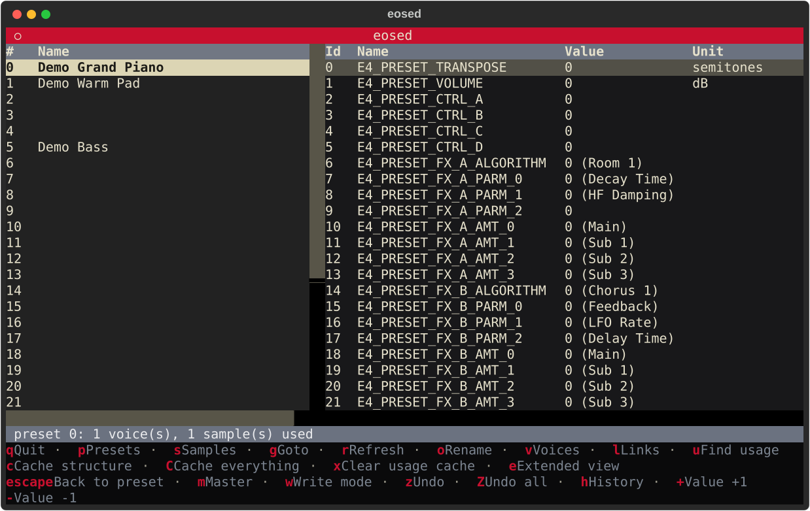
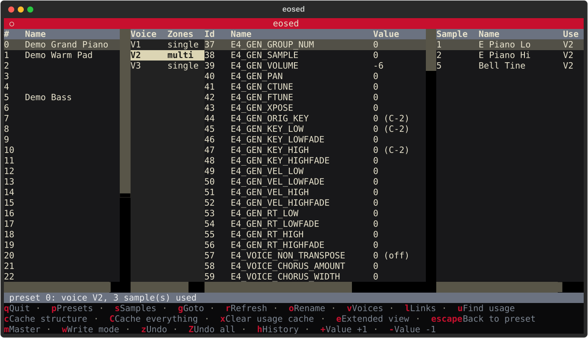
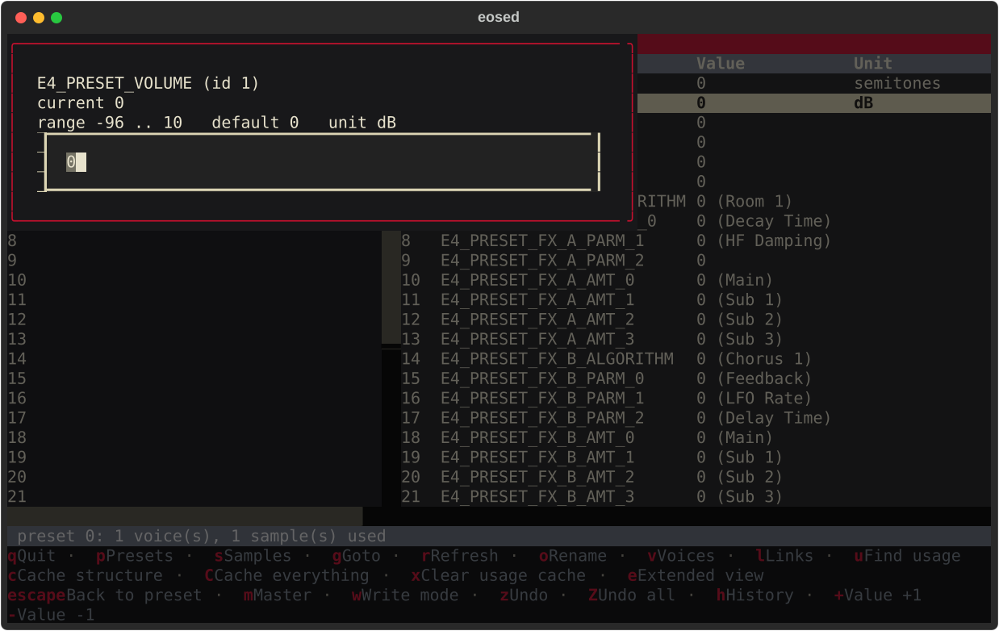
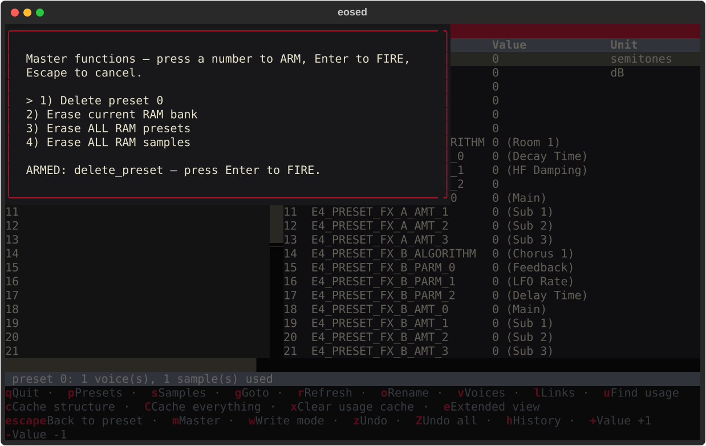

<!--
SPDX-License-Identifier: GPL-2.0-or-later
SPDX-FileCopyrightText: Copyright (C) 2026  eosed contributors
-->

# eosed

A terminal tool for the E-mu **EOS** sampler family (E4, E4XT, E4XT Ultra,
E6400, …) driven over MIDI System Exclusive — a command-line explorer
(`eoscli`) plus a full Textual TUI editor (`eosed`) for the
documented remote editor/librarian protocol, from the same author as the
sibling **k2kremote** (Kurzweil K2000/K2000R) and **mpc2emu** projects.

> **Author:** Jan Lentfer &lt;jan.lentfer@web.de&gt;, with AI support
> (Anthropic Claude) — see [AI assistance](#ai-assistance--human-authorship).
> **Legal:** [DISCLAIMER.md](DISCLAIMER.md) · [LICENSE](LICENSE)

---

## ⚠️ Use at your own risk — back up first, hardware verification is partial

eosed is provided **as is, with absolutely no warranty and no
liability** for data loss or **hardware damage**. You assume all risk.
Full terms: [DISCLAIMER.md](DISCLAIMER.md).

**eosed's *read* paths have been verified through repeated live
sessions against a real E4XT Ultra** — `eoscli inquire`/`config`/
`memory`/`catalog`/`dump`, and the full TUI's preset/voice/link/sample
browsing, bank switching, reverse sample-usage lookup, and cache-all
sweep. Live use is also what caught several real protocol bugs no amount
of reading the specification would have surfaced — see
[The "Number Of X" trap](#the-number-of-x-trap) below.

**Write paths (`--allow-write`) remain unverified against real
hardware** — parameter edits, renames, and every Master action have only
been exercised against `--demo`/synthetic tests so far, and default to
**disabled** against real hardware for exactly that reason. The E4/EOS
protocol also has several **one-shot, unconfirmed destructive**
operations (Preset Delete, Erase RAM Bank/Presets/Samples) with no
device-side "are you sure" — none are ever bound to a single keypress in
the TUI, only reachable through a modal arm-then-fire screen, but a
scripting mistake with `eoscli` directly could still fire one. **Make
current backups before pointing this at anything you care about.**

---

## AI assistance & human authorship

eosed was built by its human author, **Jan Lentfer**, together with
Anthropic's **Claude**, following the pattern of the sibling k2kremote and
mpc2emu projects. The decision to build the documented editor protocol
first — rather than start from screen-mirroring, which would require
reverse engineering before a line of protocol code could be written —
came from the human author, as did every safety rule (destructive ops
are never key-bound; synthetic-first testing; one MIDI session at a
time) and every design correction that came out of actually using the
tool against real hardware. Claude assisted with transcribing the
parameter tables from the specification and writing the implementation,
tests, and docs. Full account, including the live-hardware bug hunts
that shaped this project, in [DISCLAIMER.md](DISCLAIMER.md).

---

## Quick Start

```sh
python3 -m venv .venv
.venv/bin/pip install -e .[dev]
.venv/bin/eoscli --demo inquire
.venv/bin/eosed --demo
```

`--demo` on both entry points runs against a canned in-memory device —
no MIDI port opened, no hardware required, no local config touched. This
is the safest way to explore the tool before pointing it at real
hardware; every screenshot in this README was captured this way.

<p align="center">
  
</p>

<p align="center"><sub>The default 2-pane compact view: Preset (left) and
Parameters (right) — preset 0 selected, its GLOBAL parameter group shown.</sub></p>

Real hardware use requires a MIDI interface connected to the E4/E4XT:

```sh
.venv/bin/eoscli inquire                 # autodetect, read-only identify
.venv/bin/eosed                      # TUI, writes disabled by default
.venv/bin/eosed --allow-write        # enables edit/rename/Master — see the warning above
```

If you route through `mididings` or similar, make sure the route does
**not** strip SysEx (see `docs/RESOLUTION_NOTES.md` §5 for a gotcha the
author hit on their own setup) — though note that `eoscli`/`eosed`'s
autodetect finds the real hardware send/receive ports directly and does
not go through such a route at all (confirmed live).

Autodetect (the default when `--port` is omitted) tries every MIDI port,
which can take tens of seconds on a host with many ports. Once it
succeeds, the winning send/receive port pair is cached to `config.toml`
(gitignored) and tried first on the next connection, before falling back
to a full sweep if the cache is stale (ports renamed/gone) — pass
`--config PATH` to use a different cache file, or edit
`eos/bridge.py`'s `DEFAULT_CONFIG_PATH`/pass `config_path=None` to a
script using `EosBridge.autodetect()` directly to disable caching.

---

## eoscli — the command-line explorer

```
eoscli [--port NAME | --demo] [--device-id N] [--timeout SEC] [--config FILE] <command>
```

| Command | What it does |
|---|---|
| `ports` | list available MIDI ports |
| `inquire` | standard MIDI Device Inquiry; identifies model (E4/E4XT/E4XT Ultra/E6400/…) and EOS firmware revision |
| `config` | installed options (voice count, FX/MIDI/Octopus/Digital-I-O cards), RAM/ROM/Flash sizes |
| `memory` | Preset and Sample RAM totals/free space |
| `catalog [--range LOW-HIGH] [--progress]` | preset names over a range (default 0-127) |
| `get <param-id-or-name>` | read one parameter's current value, with its device-reported min/max/default |
| `dump <preset> <output> [--new-format]` | full preset dump to a file, using the ACK/NAK/WAIT/EOF handshake above |

```sh
.venv/bin/eoscli --demo inquire
.venv/bin/eoscli inquire                            # real hardware, autodetect
.venv/bin/eoscli catalog --range 0-269 --progress
.venv/bin/eoscli get E4_PRESET_VOLUME
.venv/bin/eoscli dump 0 preset0.bin
```

---

## eosed — the TUI

`e` toggles between a compact 2-pane view (Preset | Parameters, the
default on a fresh install) and the full 4-pane layout below; the choice
is remembered across restarts (against real hardware — `--demo` never
touches local state).

<p align="center">
  
</p>

<p align="center"><sub>Extended view: Preset · Voice · Parameters · Samples,
a voice selected — its full <code>voice.*</code> parameter group and the
sample it plays are both shown at once.</sub></p>

Four panes, left to right:

- **Preset** — a paged, on-demand catalog scan (page size adapts to how
  tall the pane is). `p`/`s` switch this pane between the Preset and the
  raw Sample bank (browse/rename either); `g` goto and `o` rename are
  bank-aware. Beyond the currently-loaded page, `PageDown`/`PageUp` jump a
  whole page forward/back (replacing what's shown, the same as `g` but
  without typing a number), and just scrolling down with the arrow keys —
  or a mouse wheel — toward the bottom of what's loaded fetches and
  appends the next 50 entries in the background automatically, so you
  never hit a hard wall at the end of a page. A raw sample has no per-sample properties in this protocol
  (no generic parameter access to loop points, root key, or sample rate
  — only its number and name); selecting one shows just that, plus `u`
  for an opt-in reverse lookup ("which presets use this sample"), with
  results shown both in the status line and — since the Samples pane is
  hidden in compact view — the Parameters pane too, so the full match
  list is visible regardless of view mode. This is a full preset-range
  sweep — not automatic, shows live progress, cancellable with `escape`
  — so on the **first** run it can take several minutes on a
  fully-populated bank; every later lookup (any sample, not just the one
  you first searched for) is then instant, no MIDI at all, until
  something is actually written. By default it stops early after 10
  consecutive presets/samples with nothing in them (a heuristic, not a
  guarantee); set `sample_usage_early_stop = "fullscan"` in `config.toml`
  to always sweep completely, or to a specific number to change the
  threshold. `c` clears the cached result on demand to force a fresh
  sweep.
- **`a`** — cache-all: the same full-bank sweep as `u`, but keeps
  *everything* it fetches instead of just the sample-usage index —
  preset and sample names, each preset's voice/zone/sample structure,
  and (depending on depth) its GLOBAL parameter values and every voice's
  own parameters too — so that browsing afterward (selecting a preset,
  `v`, paging the bank, `u`) is instant with no further MIDI at all,
  until something is actually written. How deep it goes is `cache_depth`
  in `config.toml`: `"names"` (just the two name catalogs — fast),
  `"structure"` (adds the voice/zone/sample walk and the `u` index — the
  expensive part), or `"full"` (**default** — also each preset's GLOBAL
  values and every voice's own parameter group, by far the priciest
  addition). Set `cache_all_on_startup = true` to run it automatically
  on connect instead of waiting for `a`. **Never persisted to disk** —
  rebuilt fresh every launch, deliberately: the E4XT can be edited from
  its own front panel with no way for this app to notice, so a saved
  cache could confidently show data that no longer matches the device.
- **Selecting a preset also sends it a MIDI Program Change** (no key
  binding — happens automatically), which is what actually makes the
  E4/E4XT select that preset for real and redraw its own front-panel
  LCD; the editor protocol's own `PRESET_SELECT` never does (see
  [Two protocols, one device](#two-protocols-one-device) above). Set
  `send_pc_on_preset_select = false` in `config.toml` to turn this off
  (default: on).
- **Voice** — every voice of the selected preset, with a single/
  multisample hint. `v` (from either bank) also opens a modal voice
  picker.
- **Parameters** — the selected voice's parameters, the parameters of a
  selected Link (`l`), or the preset's GLOBAL parameters if neither is
  selected; `escape` goes back.
- **Samples** — a *derived* view, not the Sample bank above: which raw
  sample(s) the selection actually plays (the whole preset's if no voice
  is selected, just that voice's otherwise), resolved from the voice's
  Sample Zone fields down to a sample number + name. Orthogonal to which
  bank the Preset pane is browsing.

Editing, renaming, and the Master menu:

<p align="center">
  
</p>

<p align="center"><sub>Editing a parameter: the dialog shows the
device-fetched current value, range, default, and unit before you type a
new one.</sub></p>

- Edits a parameter's value in place (device-fetched min/max/default
  shown), renames a preset or sample, and a modal arm-then-fire Master
  screen for the destructive utilities (Delete Preset, Erase RAM
  Bank/Presets/Samples — never bound to a single keypress).

<p align="center">
  
</p>

<p align="center"><sub>The Master menu requires two keypresses (arm, then
Enter to fire) for any destructive operation — never a single
keystroke.</sub></p>

- **Writes (edit/rename/Master) are disabled by default against real
  hardware** — pass `--allow-write` to start already armed, or press `w`
  at any point during the session to arm/disarm them at runtime (always
  starts armed for `--demo`, but `w` still toggles it there too). The
  header bar turns the E4XT badge's own red while write mode is on, a
  persistent, glanceable reminder that's easy to miss in the status line
  alone. No write path has been exercised against real hardware as
  thoroughly as the read paths yet — see [TODO.md](TODO.md).

- **Undo (`z`), undo-all (`Z`), and a change history (`h`).** Every
  parameter edit and preset rename made in the session is logged with the
  value it replaced *and* the selection it was made under (voice/link/
  global) — the protocol is stateful, so an undo re-selects that scope
  before writing the old value back, otherwise it would land on whatever
  is selected now. `z` steps back one change at a time, reporting each in
  the status line (`reverted E4_PRESET_VOLUME from 5 to 0`); `Z` returns
  the preset to how it was when loaded; `h` opens a `# | scope | parameter
  | old | new` table of everything so far — scope is a column of its
  own, since the same parameter id edited under two different voices is
  two genuinely different fields. A pending-change count shows in the
  header (`preset 12 · Δ3`) rather than the status line, which any load or
  scan would otherwise scroll away.

  The log is **in-memory and per-preset**: selecting a different preset
  discards it, since every write goes to whatever `PRESET_SELECT` points
  at and a log for an unselected preset could not be replayed safely. That
  is not a limitation so much as a reflection of how the hardware works —
  a remote edit only lives in the device's RAM until you save the bank to
  disk *on the machine itself*, so reloading the bank or power-cycling is
  the real "undo everything", and nothing here needs to survive a restart
  to be safe.

Not yet implemented: NEW-format dump/restore, editing a raw sample's own
properties (loop points, root key, sample rate — this protocol has no
generic parameter access to those; see `docs/RESOLUTION_NOTES.md` §10),
Link browsing as a persistent pane (currently a modal, same as Voice),
and anything touching the panel/mirror protocol. See [TODO.md](TODO.md).

---

## The EOS Remote Protocol — a field manual

This section documents the protocol itself, independent of either tool
built on top of it — useful if you're implementing your own client, or
just want to understand what an E4/E4XT actually exposes over MIDI.
Everything below is transcribed as *data* from E-mu's own specification,
**"Remote Preset Editing via MIDI SysEx"** (Draft #30, EOS 4.00, Brian
Clark, E-mu Systems, 17 February 1999) — see [LICENSE](LICENSE) for the
full citation — cross-checked, where noted, against real E4XT Ultra
hardware and saved preset dumps.

### Two protocols, one device

EOS exposes **two separate SysEx dialects**, and this project's position
on each is very different — keep the distinction sharp:

1. **The remote editor/librarian protocol** — `F0 18 21 <devID> 55 <cmd>
   … F7`. Fully documented in the specification above: parameter
   edit/request with live min/max/default query, preset dump/restore,
   preset/sample naming, memory/config queries, and voice/link/sample-zone
   utilities. **This is the entire subject of this section, and what
   `eos/` and `eoscli`/`eosed` implement.**
2. **The undocumented panel/remote-control protocol** — `F0 18 7F 00 00
   … F7`. What a tool like Ray Bellis's
   [e-remote](https://www.emu.tools/e-remote/) uses to mirror the
   device's own LCD and inject front-panel button presses (the same
   *kind* of thing k2kremote does for the K2000). E-mu never published
   this one; only fragments are known publicly, and **eosed does not
   implement it** — see `docs/RESOLUTION_NOTES.md` §3 for what's known
   and the reverse-engineering plan for the rest.

A subtlety worth internalizing before writing any client: **an edit made
through the editor protocol does not appear on the device's own front
panel until that preset is touched from the front panel.** The
specification states this explicitly — the remote editor writes to a
separate live buffer from what the LCD renders. Don't assume the two
agree; a TUI or script must track its own state, not read the hardware's
screen as ground truth. There is no command anywhere in the documented
protocol to force a redraw — confirmed by checking every command byte
`eos/messages.py` defines and the raw specification text itself, whose
own stated design goal is that the remote editor *replaces* the front
panel display as the interface, not drives it. The one thing that
*does* make the device select a preset for real (and redraw its own
LCD) is a plain MIDI **Program Change** — an ordinary channel voice
message, not part of this SysEx protocol at all, and exactly what a
keyboard player sends switching patches. `EosBridge.send_program_change`
implements it: Bank Select MSB is always 0, LSB selects which block of
128 presets (0 → 0-127, 1 → 128-255, …), then Program Change picks
within that block — all three messages required every time, each
separated by `SEND_GAP` (plain channel messages get no throttling of
their own the way SysEx does, and sending them back-to-back with zero
gap got them dropped or misprocessed by the MIDI interface in testing).
See `docs/RESOLUTION_NOTES.md` §14 for the live debugging story. There is
no way to read back which preset the device currently has selected this
way — `PRESET_SELECT` stays unaffected, confirmed live — so verifying it
landed correctly still means looking at the actual front panel.

### Addressing model

Every parameter lives in one of a small number of **groups**, and which
group a given `PARAMETER_EDIT`/`PARAMETER_REQUEST` addresses depends on
four **selector** parameters (themselves ordinary parameters, ids
223–227) that must be set first:

| Selector | id | Range | Selects |
|---|---|---|---|
| `PRESET_SELECT` | 223 | 0–999 | Which preset all GLOBAL/LINK/VOICE reads/writes below apply to. Independent of the front panel's own selection (spec-stated) — selecting a preset here does not change what's showing on the device's LCD. |
| `LINK_SELECT` | 224 | 0–255 | Which of the current preset's Links a `link.*`-group parameter addresses. Max is `255 − NumOfLinks`. |
| `VOICE_SELECT` | 225 | 0–255 | Which of the current preset's Voices a `voice.*`-group parameter addresses. Max is `255 − NumOfVoices`. |
| `SAMPLE_ZONE_SELECT` | 226 | 0–255 | Which zone of a *multisample* voice a Sample-Zone-scoped field (a subset of `voice.general`, see below) addresses. Reset to 0 whenever a new Voice is selected (spec-stated) — a stale zone selection left over from a previous voice is a real, easy-to-hit bug (see [The "Number Of X" trap](#the-number-of-x-trap)). |
| `GROUP_SELECT` | 227 | 0–31 | Selects a voice group for group-scoped operations. |

Once selected, a normal parameter read/write (`PARAMETER_EDIT` = `01h`,
`PARAMETER_REQUEST` = `02h`) addresses whichever group/instance the
selectors currently point at. `PARAMETER_MINMAXDEFAULT_REQUEST` (`03h`)
/ `_RESPONSE` (`04h`) return the **device's own live** min/max/default
for a given parameter id — this project's own static tables (below) are
a convenience fallback, but the live response is authoritative and
should be preferred wherever the two might drift across EOS firmware
revisions.

### Command set

The full command byte (immediately following the `55h` "special editor
designator" byte in every frame) implemented by this project's
`eos/messages.py`:

| Command | Byte | Direction | Purpose |
|---|---|---|---|
| `PARAMETER_EDIT` | `01h` | → device | Set a parameter's value |
| `PARAMETER_REQUEST` | `02h` | → device | Read a parameter's current value |
| `PARAMETER_MINMAXDEFAULT_REQUEST` | `03h` | → device | Ask for a parameter's live min/max/default |
| `PARAMETER_MINMAXDEFAULT_RESPONSE` | `04h` | ← device | Reply to the above |
| `PRESET_NAME` | `05h` | ↔ | Set/read the current preset's 16-char name |
| `PRESET_NAME_REQUEST` | `06h` | → device | Request the above |
| `PRESET_NAME_CHAR_UPDATE` | `07h` | → device | Update a single character of the name |
| `PRESET_NAME_CHAR_REQUEST` | `08h` | → device | Request a single character |
| `SAMPLE_NAME` | `09h` | ↔ | Set/read a sample's 16-char name |
| `SAMPLE_NAME_REQUEST` | `0Ah` | → device | Request the above |
| `SAMPLE_NAME_CHAR_UPDATE` | `0Bh` | → device | Update a single character |
| `SAMPLE_NAME_CHAR_REQUEST` | `0Ch` | → device | Request a single character |
| `PRESET_DUMP` | `0Dh` | ↔ | Full preset dump/restore, sub-commanded (ACK/NAK/WAIT/EOF handshake) |
| `PRESET_DUMP_REQUEST` | `0Eh` | → device | Request an OLD-format single-preset dump |
| `PRESET_MEMORY_REQUEST` / `_RESPONSE` | `10h`/`11h` | ↔ | Preset RAM total/free (KB) |
| `SAMPLE_MEMORY_REQUEST` / `_RESPONSE` | `12h`/`13h` | ↔ | Sample RAM total/free (10 KB units) |
| `CONFIGURATION_REQUEST` / `_RESPONSE` | `14h`/`15h` | ↔ | Installed option flags, RAM size |
| `PRESET_NUM_VOICES_REQUEST` / `_RESPONSE` | `16h`/`17h` | ↔ | Voice count for a preset — **see the trap below** |
| `PRESET_NUM_LINKS_REQUEST` / `_RESPONSE` | `18h`/`19h` | ↔ | Link count for a preset |
| `PRESET_NUM_SZONES_REQUEST` / `_RESPONSE` | `1Ah`/`1Bh` | ↔ | Sample-zone count for a preset |
| `VOICE_NUM_SZONES_REQUEST` / `_RESPONSE` | `1Ch`/`1Dh` | ↔ | Sample-zone count for one voice — **see the trap below** |
| `EXTENDED_CONFIGURATION_REQUEST` / `_RESPONSE` | `1Eh`/`1Fh` | ↔ | Extended option flags, ROM/Flash size |
| `NEW_VOICE` / `DELETE_VOICE` / `COPY_VOICE` | `20h`/`21h`/`22h` | → device | Voice-list editing |
| `NEW_SAMPLE_ZONE` / `GET_MULTISAMPLE` / `DELETE_SAMPLE_ZONE` / `COMBINE` / `EXPAND` | `30h`–`34h` | → device | Sample-zone editing |
| `NEW_LINK` / `DELETE_LINK` / `COPY_LINK` | `40h`/`41h`/`42h` | → device | Link-list editing |
| `SAMPLE_ERASE` / `SAMPLE_MEMORY_DEFRAG` | `50h`/`52h` | → device | Sample-memory housekeeping |
| `PRESET_COPY` | `70h` | → device | Copy a preset |
| `PRESET_DELETE` | `71h` | → device | **Destructive, one-shot, unconfirmed** |
| `MULTIMODE_MAP_DUMP` / `_REQUEST` | `72h`/`73h` | ↔ | MultiMode channel/preset map |
| `ERASE_RAM_BANK` | `74h` | → device | **Destructive, one-shot, unconfirmed** |
| `ERASE_ALL_RAM_PRESETS` | `75h` | → device | **Destructive, one-shot, unconfirmed** |
| `ERASE_ALL_RAM_SAMPLES` | `76h` | → device | **Destructive, one-shot, unconfirmed** |
| `NEW_DUMP_NAK` / `NEW_DUMP_ACK` / `EOF` / `WAIT` / `CANCEL` | `79h`–`7Dh` | ↔ | NEW-format dump handshake |
| `NAK` / `ACK` | `7Eh`/`7Fh` | ↔ | OLD-format dump handshake (1-byte packet numbers) |

Not every command above has a corresponding high-level method in
`eos.bridge.EosBridge` yet — voice/link/sample-zone list editing
(`NEW_VOICE`/`DELETE_VOICE`/…) and the destructive Master utilities
beyond what the TUI exposes are implemented at the message-codec level
in `eos/messages.py` but not yet wired into a convenience API. See
[TODO.md](TODO.md).

### The "Number Of X" trap

The specification names four sibling commands — `PRESET_NUM_VOICES`,
`PRESET_NUM_LINKS`, `PRESET_NUM_SZONES`, `VOICE_NUM_SZONES` — that read,
from their names and the surrounding text, like they return plain counts.
**Live testing against a real E4XT Ultra disproved this for three of the
four, each in its own way, and each only found by actually comparing the
TUI's numbers against the front panel** — not derivable from reading the
specification alone:

- **`VOICE_NUM_SZONES` is not a count at all**, in any consistent sense.
  Two different real presets gave zone counts that needed *different*
  additive corrections to match ground truth — no single formula
  reconciles them. The real, reliable signal turned out to be
  voice-level `E4_GEN_SAMPLE`: it reads the specification's own `3FFFh`
  "multisample" sentinel if and only if the voice genuinely is one, and
  from there the only trustworthy way to find the real zone count is to
  walk `SAMPLE_ZONE_SELECT` from 0 until `E4_GEN_SAMPLE` reads back `0`
  — empirically the clean, consistent "past the real data" signal in
  every case tested.
- **`PRESET_NUM_VOICES` looked like a simple off-by-one** (subtract 1
  from the raw wire value) — confirmed against *two* saved dump files on
  two different presets — and shipped on that basis. It then failed live
  on presets from a different, larger real bank: two presets each
  front-panel-confirmed to have exactly one real voice both read a raw
  value that the "−1" correction turned into zero. **Two independent
  cross-checks were not enough evidence for a general formula.** The
  reliable signal turned out to be the same kind as above, one level up:
  a device-consistent (but undocumented) `3FFEh` "this voice index does
  not exist" marker on voice-level `E4_GEN_SAMPLE`, distinct from the
  `3FFFh` multisample sentinel above.
- **`PRESET_NUM_LINKS`, despite sharing a command family and byte shape
  with `PRESET_NUM_VOICES`, needed no correction at all** — its raw wire
  value is already the plain, direct count. This was found by
  extrapolating the sibling's "−1" fix onto this command without an
  independent test — exactly the mistake the two points above already
  demonstrate the cost of.
- **`PRESET_NUM_SZONES`** remains unverified — not called anywhere in
  this project, deliberately, rather than guessing a fourth formula with
  zero live evidence behind it.

The lesson, demonstrated the hard way more than once in the same
afternoon: **sharing a command family, byte range, or name is no
evidence at all about how a "Number Of X" command actually behaves.**
Every one needs its own independent live check, no matter how similar it
looks to an already-confirmed sibling. `eos/bridge.py`'s
`preset_num_voices`/`voice_num_szones` now return the raw wire value
unmodified, with a docstring warning not to trust it as a count;
`eosed/app.py` walks live device state directly instead (see
`_voice_sample_info`). Full account, including the specific presets and
front-panel readings involved, in `docs/RESOLUTION_NOTES.md` §11–§12.

### Parameter groups

Every parameter is addressed by a 14-bit id. `eos/params.py` gives each
one a name, group, and a *static* min/max transcribed from the
specification (the device's own `03h`/`04h` response is authoritative at
runtime and should be preferred where the two might drift). The table
below is the group structure; full per-id detail is in the module
itself, kept close to the wire so it stays a trustworthy reference.

#### GLOBAL (ids 0–21) — one set per preset

| Parameter | Range | Notes |
|---|---|---|
| `E4_PRESET_TRANSPOSE` | −24..24 semitones | |
| `E4_PRESET_VOLUME` | −96..10 dB | |
| `E4_PRESET_CTRL_A`–`_D` | −1..127 | −1 = off |
| `E4_PRESET_FX_A_ALGORITHM` | 0..44 | see [FX algorithms](#fx-algorithms) |
| `E4_PRESET_FX_A_PARM_0`–`_2`, `FX_B_PARM_0`–`_2` | varies | processor-specific (Decay Time, Feedback, …) |
| `E4_PRESET_FX_A_AMT_0`–`_3`, `FX_B_AMT_0`–`_3` | 0..100 % | send level to bus Main/Sub1/Sub2/Sub3 |
| `E4_PRESET_FX_B_ALGORITHM` | 0..27 | see [FX algorithms](#fx-algorithms) |

#### LINK (ids 23–35, plus filter-enable flags at 251–266)

A Link layers another preset on top of the current one across a
key/velocity range. `LINK_SELECT` (id 224) picks which one.

| Parameter | Range | Notes |
|---|---|---|
| `E4_LINK_PRESET` | 0..999 | which preset this link plays |
| `E4_LINK_VOLUME` | −96..10 dB | |
| `E4_LINK_PAN` | −64..63 | |
| `E4_LINK_TRANSPOSE` | −24..24 semitones | |
| `E4_LINK_FINE_TUNE` | −64..64 | |
| `E4_LINK_KEY_LOW`/`_HIGH` (+`_LOWFADE`/`_HIGHFADE`) | 0..127 | C-2 → G8 |
| `E4_LINK_VEL_LOW`/`_HIGH` (+ fades) | 0..127 | |
| `E4_LINK_INTERNAL_EXTERNAL` (id 251) | 0..16 | |
| `E4_LINK_FILTER_PITCH`/`_MOD`/`_PRESSURE`/`_PEDAL` (ids 252–255) | 0/1 | per-modulator filter-enable flags |
| `E4_LINK_FILTER_CTRL_A`–`_H` (ids 256–263) | 0/1 | 0 = filter off, 1 = filter on |
| `E4_LINK_FILTER_SWITCH_1`/`_2`, `E4_LINK_FILTER_THUMB` (ids 264–266) | 0/1 | |

The specification states 29 total Link parameters (58 bytes/link in a
preset dump): the 13 core fields above plus the 16 filter-enable flags at
ids 251–266. The table matches that count exactly.

#### VOICE — general (ids 37–56)

`VOICE_SELECT` (id 225) picks which voice. A subset of these fields
(id 38 plus 12 others — see `SAMPLE_ZONE_PARAM_IDS` in `eos/params.py`)
are **Sample Zone** scoped instead of whole-voice scoped for a
multisample voice, addressed together with `SAMPLE_ZONE_SELECT`.

| Parameter | Range | Notes |
|---|---|---|
| `E4_GEN_GROUP_NUM` | 1..32 | |
| `E4_GEN_SAMPLE` | 0..999 (2999 w/ Flash) | `3FFFh` = multisample sentinel, `3FFEh` = "no such voice" (both undocumented — see [the trap above](#the-number-of-x-trap)) |
| `E4_GEN_VOLUME` | −96..10 dB | |
| `E4_GEN_PAN` | −64..63 | |
| `E4_GEN_CTUNE` | −72..24 | **voice-only**, not zone-scoped |
| `E4_GEN_FTUNE` | −64..64 | |
| `E4_GEN_XPOSE` | −24..24 semitones | **voice-only** |
| `E4_GEN_ORIG_KEY` | 0..127 | 60 = C3; **sample-only** |
| `E4_GEN_KEY_LOW`/`_HIGH` (+ fades) | 0..127 | C-2 → G8 |
| `E4_GEN_VEL_LOW`/`_HIGH` (+ fades) | 0..127 | |
| `E4_GEN_RT_LOW`/`_HIGH` (+ fades) | 0..127 | release-trigger range; **voice-only** |

#### VOICE — tuning / chorus / glide (ids 57–64)

| Parameter | Range | Notes |
|---|---|---|
| `E4_VOICE_NON_TRANSPOSE` | 0/1 | |
| `E4_VOICE_CHORUS_AMOUNT` | 0..100 % | |
| `E4_VOICE_CHORUS_WIDTH` | −128..0 | |
| `E4_VOICE_CHORUS_X` | −32..32 (display: ±0–1.451 ms) | initial ITD; `cnv_chorus_itd()` |
| `E4_VOICE_DELAY` | 0..10000 ms | |
| `E4_VOICE_START_OFFSET` | 0..127 | |
| `E4_VOICE_GLIDE_RATE` | 0..127 (display: sec/oct) | portamento; `cnv_glide_rate()` — transcribed lookup table, see below |
| `E4_VOICE_GLIDE_CURVE` | 0..8 | 0 = linear .. 8 = most exponential |

#### VOICE — mode (ids 65–67)

| Parameter | Range | Notes |
|---|---|---|
| `E4_VOICE_SOLO` | 0..8 | Off / Multiple Trigger / Melody (last/low/high) / Synth (last/low/high) / Fingered Glide |
| `E4_VOICE_ASSIGN_GROUP` | 0..23 | Poly All / Poly16 A-B / Poly8 A-D / Poly4 A-D / Poly2 A-D / Mono A-I |
| `E4_VOICE_LATCHMODE` | 0/1 | |

#### VOICE — amplifier + envelope (ids 68–81)

| Parameter | Range | Notes |
|---|---|---|
| `E4_VOICE_VOLENV_DEPTH` | 0..16 | −96 dB to −48 dB, steps of 3 |
| `E4_VOICE_SUBMIX` | −1..3 (−1..7 w/ Octopus card) | voice / main / sub1-7 |
| Envelope: `VENV_SEG0`–`SEG5` `_RATE`/`_TGTLVL` | rate 0..127, level 0..100 % | 6-stage: Atk1 → Dcy1 → Rls1 → Atk2 → Dcy2 → Rls2 |

#### VOICE — filter + envelope (ids 82–104)

| Parameter | Range | Notes |
|---|---|---|
| `E4_VOICE_FTYPE` | 0..255 (21 named types) | see [filter types](#filter-types) |
| `E4_VOICE_FMORPH` | 0..255 | Fc/Morph |
| `E4_VOICE_FKEY_XFORM` | 0..127 | meaning varies by filter type |
| `E4_VOICE_FILT_GEN_PARM1`–`_8` | 0..255 | filter-type-dependent overlay — see `docs/RESOLUTION_NOTES.md` §2 before trusting an unfamiliar type |
| Envelope: `FENV_SEG0`–`SEG5` `_RATE`/`_TGTLVL` | rate 0..127, level 0..100 % | same 6-stage shape as the amp envelope |

#### VOICE — LFOs and the auxiliary envelope (ids 105–128)

Two independent LFOs, each with its own rate/shape/delay/depth/sync;
LFO2 additionally drives a third, dedicated 6-stage envelope (same shape
as amp/filter) through two lag processors.

| Parameter | Range | Notes |
|---|---|---|
| `E4_VOICE_LFO_RATE` / `LFO2_RATE` | 0..127 | display conversion **not implemented** — the source table's page-break transcription was ambiguous (129 entries recovered against an expected 128); the raw value is fully usable for control, only the cosmetic Hz string is missing — see `docs/RESOLUTION_NOTES.md` §2 |
| `E4_VOICE_LFO_SHAPE` / `LFO2_SHAPE` | 0..7 | triangle / sine / sawtooth / square / `0,1,0,-1` / `C,E,G,C` / `C,D,F,G` / 8-step pentatonic |
| `E4_VOICE_LFO_DELAY` / `LFO2_DELAY` | 0..127 | |
| `E4_VOICE_LFO_VAR` / `LFO2_VAR` | 0..100 % | |
| `E4_VOICE_LFO_SYNC` / `LFO2_SYNC` | 0/1 | key-sync / free-run |
| `E4_VOICE_LFO2_OP0_PARM` / `OP1_PARM` | 0..10 | Lag0/Lag1 |
| Aux envelope: `AENV_SEG0`–`SEG5` `_RATE`/`_TGTLVL` | rate 0..127, level 0..100 % | LFO2-driven, same 6-stage shape |

#### VOICE — modulation matrix ("cords") (ids 129–182)

18 independent modulation routings per voice, each a `SRC`/`DST`/`AMT`
triple (`E4_VOICE_CORD0_SRC` .. `CORD17_AMT`, ids 129–182). Amount is
−100..100; source and destination are each an 8-bit code from the
specification's own named lists (partial transcription — an
unrecognized code should display as its raw number, not error):

<details>
<summary>Modulation sources (named subset)</summary>

`Off` `XfdRnd` `Key+` `Key~` `Vel+` `Vel~` `Vel<` `RlsVel` `Gate`
`PitWl` `ModWl` `Press` `Pedal` `MidiA`–`MidiH` `MidiVl` `MidPn` `Thumb`
`ThmFF` `KeyGld` — envelope taps `VEnv+`/`~`/`<`, `FEnv+`/`~`/`<`,
`AEnv+`/`~`/`<` — `Lfo1~`/`+`, `Lfo2~`/`+`, `White`, `Pink`, `kRand1/2`,
`Lag0`/`Lag1` (+ `in` variants) — clock taps `CkDwhl` `CkWhle` `CkHalf`
`CkQtr` `Ck8th` `Ck16th` — utility `DC` `Sum` `Switch` `Abs` `Diode`
`FlipFlop` `Quantiz` `Gain4X`.

</details>

<details>
<summary>Modulation destinations (named subset)</summary>

`Off` `KeySust` `FinePtch` `Pitch` `Glide` `ChrsAmt` `ChrsITD`
`SStart` `SLoop` `SRetrig` `FilFreq` `FilRes` `AmpVol` `AmpPan` `AmpXfd`
— per-envelope `Rts`/`Atk`/`Dcy`/`Rls`/`Trig` for VEnv/FEnv/AEnv —
`Lfo1Rt`/`Trig`, `Lfo2Rt`/`Trig`, `Lag0in`/`Lag1in` — utility `Sum`
`Switch` `Abs` `Diode` `FlipFlop` `Quantiz` `Gain4X` — and `C00Amt`
.. `C03Amt` (feeding another cord's own amount).

</details>

#### FX algorithms

Preset FX A/B (ids 6–21) share their algorithm and parameter-name tables
with the MASTER FX A/B bus (ids 228–245) — 44 A-side algorithms (Room/
Hall/Plate reverbs, delays, gated/panning variants) and 32 B-side
(Chorus/Flange/Delay/Distortion families). **The id-to-name mapping is
an assumption** (row-major reading order of an unnumbered manual table),
not independently hardware-confirmed — see the extensive caveat comment
above `FX_A_ALGORITHM_NAMES` in `eos/params.py` for two known open
discrepancies before trusting it beyond a convenience UI label.

#### Filter types

21 named filter types (`E4_VOICE_FTYPE`, id 82): 3 lowpass slopes
(2/4/6-pole), 2 highpass (2nd/4th order), 3 bandpass/contrary-bandpass,
3 swept EQ variants, 4 phaser/flanger types, 2 vocal formant filters, and
3 dual/morphing EQ types. Unlike the FX tables above, this list has no
page-wrap ambiguity in the source and its count matches the manual's own
stated total exactly — see `FILTER_TYPE_NAMES` in `eos/params.py`.

#### MASTER (ids 183–222, 267–271) and addressing (223–227)

Global-to-the-device settings, independent of any preset: master
tuning/transpose/headroom, digital output format/clock, SCSI id/
termination, and a large `master.midi` block (basic channel, MIDI mode,
per-continuous-controller assignment for pitch/mod/pressure/pedal/
switches/thumbwheel/8 MIDI controller pedals, velocity/CC7 response
curves). The four addressing selectors (`PRESET_SELECT`/`LINK_SELECT`/
`VOICE_SELECT`/`SAMPLE_ZONE_SELECT`/`GROUP_SELECT`) live in this same id
range (223–227) — see [Addressing model](#addressing-model) above — as
do the MASTER FX bus (228–245) and MultiMode channel/preset/volume/pan/
submix settings (246–250).

Four more master settings sit past the Link block, inside the
specification's own `/** ULTRA ONLY PARAMETERS **/` fence — word clock
source (`MASTER_WORD_CLOCK_IN`, 267: Internal/BNC/AES/ADAT), word clock
phase in/out (268/269, 0–511 = 0.00–359.30° in 512 increments) and
`MASTER_OUTPUT_DITHER` (270). An E4XT/E6400 **Ultra** has these; a plain
E4/E4XT does not, so treat the device's own `03h`/`04h` min/max/default
reply as the authoritative "does this id exist here" check.
`MASTER_AUDITION_KEY` (271) is outside that fence and applies to every
model.

### Display-conversion curves

A handful of parameters store a raw value that only makes sense once run
through a specification-defined conversion — `eos/params.py` implements
each as a closed-form formula or a transcribed lookup table, ported
faithfully from the spec's own worked tables/C source rather than
approximated:

- **Filter Hz** (`fil_freq`/`filter_table_1`–`_3`/`cnv_morph_freq`) —
  exponential 0–255 → Hz mapping, three variants with different
  max-frequency/step-multiplier pairs.
- **Filter morph gain** (`cnv_morph_gain`) — 0–127 → ±24 dB.
- **Glide rate** (`cnv_glide_rate`) — a genuinely irregular two-table
  lookup (128 entries each), reproduced exactly rather than curve-fit,
  since the raw table has no simple closed form.
- **Master tuning offset** (`cnv_master_tuning`) — 65-entry magnitude
  table, sign taken from the raw −64..64 value.
- **Chorus initial ITD** (`cnv_chorus_itd`) — 33-entry ms magnitude
  table, same signed-magnitude shape.
- **LFO rate** — deliberately **not implemented**; see the note in
  [VOICE — LFOs](#voice--lfos-and-the-auxiliary-envelope-ids-105128)
  above.

### Preset dump formats

`PRESET_DUMP_REQUEST`/`PRESET_DUMP` (OLD format, `0Eh`/`0Dh`) transfers a
complete preset — name, GLOBAL parameters, every Link, every Voice — using
a simple 1-byte-packet-number `ACK`(`7Fh`)/`NAK`(`7Eh`) handshake. The NEW
format additionally negotiates a header (total byte count, per-group
counts) before the payload, using its own `ACK`(`7Ah`)/`NAK`(`79h`)/
`EOF`(`7Bh`)/`WAIT`(`7Ch`)/`CANCEL`(`7Dh`) handshake. **Only the OLD
format's header-ACK handling has been confirmed live** (a real bug —
the dump engine wasn't ACKing the header before expecting data — was
found and fixed this way); the NEW format's equivalent handling is
extrapolated from that fix, not independently verified. See
`docs/RESOLUTION_NOTES.md` §6/§7, and `../mpc2emu/docs/E4B_FORMAT.md` for
cross-checking dump field order against the file-format side of EOS that
project already reverse-engineered independently.

---

## Project Structure

```
eos/
  messages.py    SysEx frame codec: Command enum, every request/response dataclass
  params.py      Parameter id -> name/group/range table, enums, display-conversion curves
  bridge.py      EosBridge: transport (MIDI ports, throttled output), autodetect, config.toml
eosed/
  cli.py         eoscli entry point
  app.py         eosed Textual TUI
  demo.py        DemoBridge: canned in-memory device for --demo, no MIDI ever opened
docs/
  RESOLUTION_NOTES.md   how open items were/are being resolved (RE procedures, live-hardware notes)
  screenshots/          the SVGs embedded in this README (--demo, headless)
tests/
  synthetic only -- fake MIDI ports / fake device replies, no hardware required
```

## Known Limitations

- The undocumented panel/mirror protocol (screen mirroring, front-panel
  button injection) is entirely out of scope for the current codebase —
  see [Two protocols, one device](#two-protocols-one-device).
- NEW-format preset dump/restore is implemented but not live-verified
  (see [Preset dump formats](#preset-dump-formats)).
- A raw sample's own properties (loop points, root key, sample rate) have
  no generic parameter access in this protocol at all — not a gap in
  this project, a real protocol limitation (`docs/RESOLUTION_NOTES.md`
  §10).
- `PRESET_NUM_SZONES` is unverified against real hardware and unused —
  see [The "Number Of X" trap](#the-number-of-x-trap).
- Write paths (`--allow-write`) are unverified against real hardware —
  see the warning at the top of this README and [TODO.md](TODO.md).

## Tests

```sh
.venv/bin/python -m pytest
```

All tests are synthetic (fake MIDI ports / fake device replies) — no
hardware is touched or required.

## License and Third-Party Sources

GPL-2.0-or-later. See [LICENSE](LICENSE) for the full text and the
third-party attribution table (the SysEx protocol facts transcribed from
E-mu's specification; the transport layer and the TUI's key-hint legend
folding ported from k2kremote/mpc2emu).

## Trademarks

E-mu, Emulator, EOS are trademarks of Creative Technology Ltd. The author is
not affiliated with, endorsed by, or otherwise connected to Creative
Technology / E-mu Systems.
